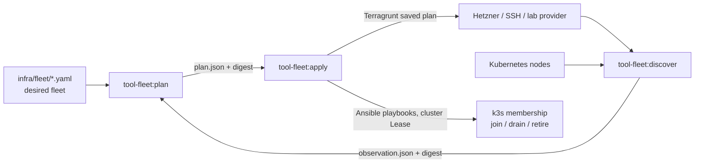
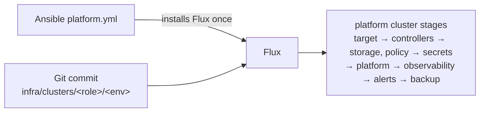
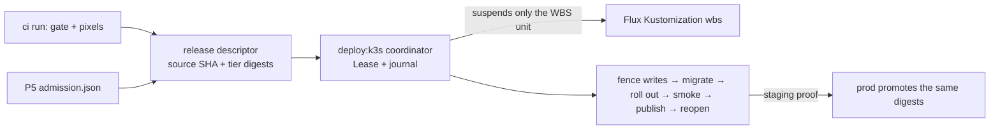

# Infrastructure operator guide

The fleet and its delivery tooling belong to Twilight Dash.

Start here to run the k3s fleet and deliver WBS onto it. Each row below names one command and
its required inputs, and links to the doc that explains it. Flags, refusals and evidence live
in those docs, not here.

| Doc                             | Owns                                                                        |
| ------------------------------- | --------------------------------------------------------------------------- |
| [local](local.md)               | k3d profiles, source-run dev environments, fresh-clone walkthrough          |
| [fleet](fleet.md)               | node identities, Ubuntu VM lab, enroll/retire/replace/upgrade               |
| [platform](platform.md)         | Flux stages, admission, secrets, registry, certificates, observability      |
| [deployment](deployment.md)     | WBS release transaction, descriptor, staging/prod promotion, CI/CD          |
| [recovery](recovery.md)         | backups, cold restore, maintenance, health, synthetic worker drills         |
| [cutover plan](cutover-plan.md) | the one-time Compose → k3s production move (prepared, not authorized)       |
| `infra/terraform/README.md`     | Terragrunt provision/destroy inputs: backend evidence, variables, the token |

## Commands

Run from the repository root. `<k>` is a kubeconfig, `<kubectl>` the locked kubectl, and
`<plan>` an operation plan written by `tool-fleet:plan`. **F12** records what the F12 handoff
ran on 2026-09-18 (commit `afc4ceb7` plus the F12 fixes). **Evidence** points at an earlier
recorded run. A row with neither has never run.

| Operation                  | Command                                                                                                                                                                              | Required inputs                                                                                                                      | Tested                                                                                                                                                                                                                                |
| -------------------------- | ------------------------------------------------------------------------------------------------------------------------------------------------------------------------------------ | ------------------------------------------------------------------------------------------------------------------------------------ | ------------------------------------------------------------------------------------------------------------------------------------------------------------------------------------------------------------------------------------- |
| Local k3d lab up/down      | `bunx nx run tool-fleet:lab -- up\|status\|down --id <id> --profile app\|platform\|fleet`                                                                                            | Docker; `K3D`, `KUBECTL` set to the locked binaries ([tools](local.md#tools)); `--worktree-root <dir>` for `up`                      | F12: `app` up in 53 s, `status` listed one Ready node, `down` in 1.2 s left no container, network or volume. Evidence: [F9](../../openspec/changes/k3s-platform/verify.md#f9-source-run-development-2026-09-18-worktree-changetbf-f9) |
| Ubuntu VM lab up/down      | `bunx nx run tool-fleet:lab -- up\|status\|down --provider qemu --lab-id <id> --profile platform\|workers`                                                                           | `/dev/kvm`; `--qemu-prefix <dir>` with the build locked in `infra/local/qemu-lab.lock.json`; `--ssh-public-key`, `--ssh-private-key` | F12: `status` only (no machines). Evidence: `up`, `spare`, `fence`, `down` in the [fleet verification](../../openspec/changes/k3s-fleet/verify.md). The default Multipass provider has never run live                                 |
| Source-run dev environment | `bunx nx run tool-devsync:dev-env -- up\|status\|down --slug <slug> --worktree <path> --cluster puni-<id>-platform`                                                                  | a running `app` lab; a worktree under its `--worktree-root` after `bun install` and `bun run dev:setup`                              | F12: `status` against the F12 `app` lab (`not running`, exit 0). Evidence: `up`/`down` and the live check in F9                                                                                                                       |
| Discover                   | `bunx nx run tool-fleet:discover -- --fleet <fleet.yaml> --output <new observation.json>`                                                                                            | `tool-fleet:controller-image` controller image; `HCLOUD_TOKEN`, `KUBECONFIG`, SSH agent; `--lab-state <dir>` instead for a VM lab    | F12: refused without `--fleet`. Evidence: VM lab only; production discovery has never run                                                                                                                                             |
| Plan provision             | `bunx nx run tool-fleet:terragrunt-plan -- ...`, then `bunx nx run tool-fleet:plan -- --operation provision ...`                                                                     | `TF_HTTP_*`, `HCLOUD_TOKEN`, backend evidence, owner-only `.tfvars` (`infra/terraform/README.md`)                                    | F12: refused without `--node`. Evidence: local-state Terragrunt smoke only; no remote backend, no paid node                                                                                                                           |
| Apply any plan             | `bunx nx run tool-fleet:apply -- --plan <plan> --expect-sha256 <printed digest>`                                                                                                     | the plan and its `<plan>.*` artifacts; the reviewed digest                                                                           | F12: a wrong digest refused before any effect. Evidence: VM lab enroll, retire and replace                                                                                                                                            |
| Enroll an existing host    | `bunx nx run tool-fleet:plan -- --operation enroll --node <id> --cluster <id> --inventory-sha256 ... --ansible-variables-sha256 ... --known-hosts-sha256 ...`, then apply            | observation; static inventory, Ansible variables and `known_hosts` artifacts beside the plan                                         | Evidence: VM lab `spare-1`, re-apply a no-op                                                                                                                                                                                          |
| Retire                     | `bunx nx run tool-fleet:plan -- --operation retire ...`, then apply ([fleet](fleet.md#retirement-replacement-and-upgrade))                                                           | observation; backup receipt; inventory and `known_hosts` hashes                                                                      | F12: planned `workers-agent-a` from `infra/fleet/examples/local.yaml` and a synthetic observation, printed its digest. Evidence: VM lab agent retirement and last-capability refusal                                                  |
| Replace a vanished node    | `bunx nx run tool-fleet:plan -- --operation replace --node <id> --fence-receipt-sha256 ...`, apply, then enroll the replacement                                                      | a fence receipt at `<plan>.fence-receipt.json` for the exact provider identity                                                       | Evidence: VM lab fence of `agent-2`, replacement by `spare-1`                                                                                                                                                                         |
| Destroy a retired server   | `bunx nx run tool-fleet:terragrunt-destroy-plan -- ...`, then `bunx nx run tool-fleet:plan -- --operation destroy ...`                                                               | the retirement receipt; Terragrunt inputs as for provision                                                                           | F12: refused without `--node`. Never run                                                                                                                                                                                              |
| Upgrade k3s                | `bunx nx run tool-fleet:plan -- --operation upgrade --node <id> --version <locked> --upgrade-evidence-sha256 ... --inventory-sha256 ... --known-hosts-sha256 ...`, then apply        | `<plan>.upgrade-evidence.json` and `<plan>.recovery-token` artifacts                                                                 | F12: refused without `--version`. Planner and playbook syntax only; no live upgrade                                                                                                                                                   |
| Bootstrap the platform     | `infra/ansible/playbooks/platform.yml` through the locked controller ([platform](platform.md))                                                                                       | cluster ID; Flux, Git commit, read-only deploy key, SOPS age key, host keys                                                          | Evidence: k3d graph reconciliation; never on a real host                                                                                                                                                                              |
| Fleet and platform check   | `bunx nx run tool-fleet:check`, `bunx nx run tool-fleet:check:faults`                                                                                                                | locked tools from `tools/tool-fleet/src/check-tools.json`                                                                            | Evidence: [F11](../../openspec/changes/k3s-wbs-delivery/verify.md#backup-move-and-fable-review-repairs-2026-09-18)                                                                                                                    |
| SQLite backup and restore  | CronJob `wbs-solver/sqlite-backup`; restore Job ([recovery](recovery.md#sqlite)); lab: `bunx nx run tool-deploy:test:backup`                                                         | Secret `sqlite-backup-s3`; the report key and its SHA-256                                                                            | Evidence: k3d lab against the in-cluster MinIO                                                                                                                                                                                        |
| Cold restore               | `bunx nx run tool-fleet:recover -- record-manifest\|verify-cold-restore\|rebind-volume\|remove-attachment ...`, then `infra/ansible/playbooks/restore.yml`                           | escrowed token and SOPS age key, recovery manifest, snapshot, `fences.json`                                                          | F12: refused without a subcommand. Evidence: [F10](../../openspec/changes/k3s-platform/verify.md#f10-recovery-and-maintenance-drills) on k3d and on a QEMU VM                                                                         |
| Health                     | `bunx nx run tool-fleet:health -- --cluster <id> --kubeconfig <k> --kubectl <kubectl>`                                                                                               | a cluster running the platform graph                                                                                                 | F12: on the `app` lab it threw naming the missing Flux `kustomizations` resource (the graph is absent). Evidence: F10 fault drills                                                                                                    |
| Maintenance                | `bunx nx run tool-fleet:maintenance -- plan --input <evidence.json>`                                                                                                                 | recorded evidence naming `operation` ([recovery](recovery.md#routine-maintenance))                                                   | F12: an absent input refused by path. Planners only; nothing executed on hosts                                                                                                                                                        |
| Synthetic worker drills    | `bunx nx run harness-example:package`, then `bunx nx run tool-fleet:synthetic -- dispatch\|reconcile\|cancel ...`                                                                    | workers cluster kubeconfig, `--kubectl`, `--journal`                                                                                 | Evidence: F10 on k3d                                                                                                                                                                                                                  |
| Local release rehearsal    | `bunx nx run tool-deploy:test:k3s`; by hand `bunx nx run tool-deploy:deploy:k3s -- --request <request.json> --journal <dir>/release.json [--apply]`                                  | locked `K3D`, `KUBECTL`; about 3 GiB free                                                                                            | Evidence: F8/F11 k3d runs                                                                                                                                                                                                             |
| Staging release            | `bunx nx run tool-deploy:descriptor -- seal ... --repository <clone> --main-ref <ref>`, then `deploy:k3s --descriptor ... --environment staging`; normally `deploy-k3s.yml` dispatch | P5 installed-package admission, the `staging` environment, deploy runner and repository ([CI/CD](deployment.md#cicd))                | F12: both printed usage. Never run                                                                                                                                                                                                    |
| Production promotion       | `deploy-k3s.yml` with `environment: prod`, `staging_run_id`, `descriptor_sha256`                                                                                                     | a staging proof for that descriptor; the `prod` environment                                                                          | Never run                                                                                                                                                                                                                             |
| Compose → k3s cutover      | rehearsal `bunx nx run tool-deploy:rehearse:cutover`; production steps use `bunx nx run tool-deploy:cutover -- ...` ([cutover plan](cutover-plan.md))                                | every `INPUT` in the plan and a separate authorization of that exact plan                                                            | F12: `cutover` printed usage. Evidence: rehearsal on k3d; production not authorized                                                                                                                                                   |

## Who owns what

Each arrow is a persisted, reviewed artifact; nothing downstream trusts a live read it did not
recheck.

## Tested platforms

What ran, from the `verify.md` files of `k3s-fleet`, `k3s-platform` and `k3s-wbs-delivery`:

- **k3d** v5.9.0 with the locked `v1.36.4-k3s1` image on one 24-core, 31 GiB Linux host: the
  Flux platform graph, admission and network drills, observability and backup drills, the WBS
  release transaction, dev environments, cold restore, worker-cluster recreation, the backup
  lab and the Compose → k3s cutover rehearsal.
- **Rootless QEMU/KVM** (QEMU 8.2.2) running Ubuntu 24.04 cloud images, at most three 2 GiB VMs:
  bootstrap, join and validation with a stable second pass; firewall reboot persistence and
  startup refusal; retirement, last-capability refusal, fenced replacement and enrollment; the
  solver role and trusted-path admission; `restore.yml`.
- **Local MinIO** inside the k3d cluster as the object store for etcd, SQLite, Elastic and
  Velero backups.
- **No Hetzner**: no hcloud token or paid machine was used.

That does not certify:

- Hetzner CSI access modes (RWO/RWOP), Retain volumes, private-network MTU or provider firewall.
- Worker isolation across distinct physical hosts, or HA control-plane removal and upgrade.
- The remote Terragrunt HTTP backend or live hcloud provisioning.
- Registry publication: of the controller image, of `WBS_SHA`-labelled Dagger images, or of
  the `twilight-bureaucrat` package.
- Any GitHub Actions run of `infra-check`, `deploy-k3s` or the package release workflow.
- Staging, production promotion or the production cutover.
