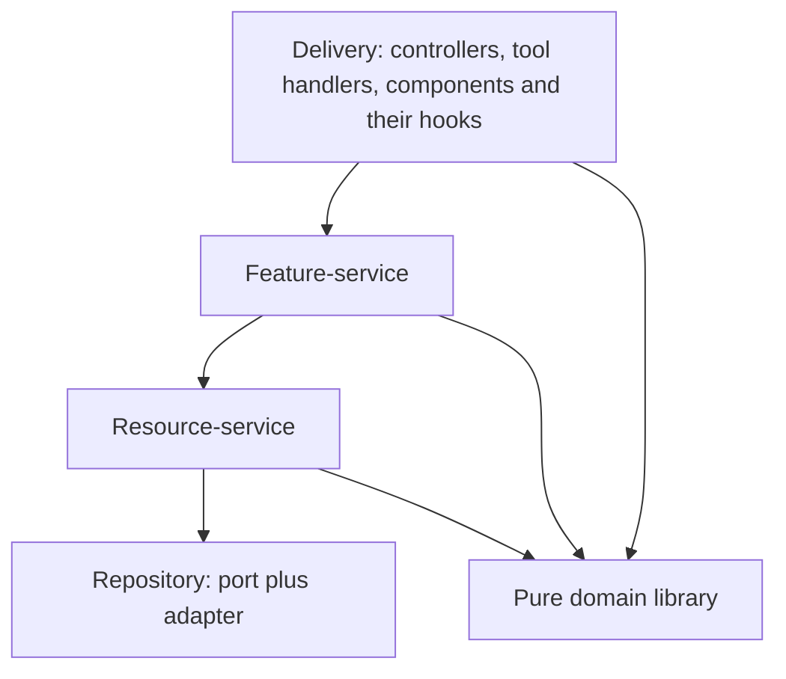

# Code organization design

Status: proposed design, composed from Dany's decisions in conversation on 2026-09-19. Nothing
here is implemented. The [rollout plan](../plans/2026-09-19-code-organization-rollout.md)
orders the work. Names follow [names and boundaries](../../twilight-structure/names.md).

## Intent

**Problem.** Frontend and backend code is organized by different, mostly implicit rules. The
backend core mixes two kinds of service in one flat directory of about 45 files. The frontend
has no composition root, one API interface of 56 methods inside a file of 2,744 lines, policy
trapped inside React hooks, and one component file of 6,422 lines. Agents pay for this in
context, in lease contention and in slow test loops.

**Outcome.** One system, the same on both sides, organized by the value code delivers to a
user. Every service has a kind, every kind has a direction it may depend in, every service
lives in a module that is also a wiki module, every behaviour has a capability that owns it,
and every test says what level it is, which module it belongs to and which scenario it proves.
Twilight Bureaucrat can check all of it from a Git revision.

**Non-goals.** No rewrite by decree: existing code is classified in place and moved only when
it is touched or when measurement justifies it. No new state library, UI library or framework
is mandated. No change to the rings, the ports, the unit of work, the HTTP contracts or the
WebSocket protocol. The Twilight tools are designed elsewhere, Twilight Bureaucrat in its
[rules design](2026-09-19-twilight-bureaucrat-rules-design.md); this document states only what
they must be able to check, run and generate.

**Constraints.** Rules R1 to R5 govern. Every enforced rule ships with a production-path
negative proof. Behavioural and architectural steps go through OpenSpec. WBS source arrives by
sync from the upstream WBS repository, so WBS slices land upstream first.

## Assumptions

Dany answered "yes" to four defaults on 2026-09-19. They are recorded here so a later reader
can reopen them.

1. Twilight Bureaucrat absorbs the verification half of the separately planned verifier tool.
2. Four frontend rules are enforced and four start as recommended practice. See
   [Frontend organization](#frontend-organization).
3. A test at the API level or above must cite a scenario.
4. Twilight Dash starts as a facade over the existing deploy, fleet and build tools, and the
   lease authority moves into it from the Bureaucrat package.

## Four kinds and one direction



| Kind             | What it is                                                                                                            | Its name comes from                       |
| ---------------- | --------------------------------------------------------------------------------------------------------------------- | ----------------------------------------- |
| Repository       | Raw access to one external thing: a table store, a third-party API, browser storage, a socket. It holds no decisions. | The thing it reaches                      |
| Resource-service | The quirks and invariants of one resource.                                                                            | One aggregate term in the owning glossary |
| Feature-service  | One piece of user-facing value, delivered by coordinating resource-services.                                          | One requirement group of one capability   |
| Delivery         | The edge that people or machines touch. It holds no policy.                                                           | The route, tool or screen                 |

The content of a kind differs by side and the kind does not. A backend resource-service holds
constraints, write stamps and ordering. A frontend resource-service holds staleness, refresh,
optimistic state and stream replay. Adding a team and then attaching it to a row is the model
feature-service: one gesture over two resources.

A repository is a pair: a port owned by the framework-free core and an adapter that satisfies
it, exactly as ADR 0014 defines. Depending on a repository means depending on the port.

### Two tests that keep the kinds honest

- A feature-service serves exactly one capability. One without a capability is either missing
  its specification or is not a feature.
- A resource-service is named after one glossary term. One whose name is not a term is either
  missing its term or is not a resource.

A resource is an aggregate: the consistency boundary a user would recognise, not a table. A
work item with its estimates and dependencies is one resource even though three stores back
it. Table-sized resources turn the layer into pass-through code and push the logic up into
scripts, the outcome Fowler calls the anemic domain model.

### Direction rules

| Rule | Statement                                                                                                           |
| ---- | ------------------------------------------------------------------------------------------------------------------- |
| K1   | Every service file declares exactly one kind.                                                                       |
| K2   | Delivery imports feature-services only, never a resource-service or a repository.                                   |
| K3   | A feature-service imports resource-services and the domain library, never a repository. Layering is strict.         |
| K4   | A resource-service imports repository ports and the domain library, never a feature-service.                        |
| K5   | A repository imports nothing above it.                                                                              |
| K6   | No kind imports a sibling of the same kind from another module. Sideways work goes through a published event.       |
| K7   | The feature-service owns the transaction. A resource-service never opens one; it is built over the admitted stores. |
| K8   | Each table belongs to exactly one resource module. The migration facts the wiki tool already extracts prove it.     |
| K9   | A feature-service names its capability; a resource-service names its glossary term. Both are machine-readable.      |

K3 accepts a known cost: plain create and rename operations take three hops. Dany chose
uniformity over that saving. One rule with no judgment calls suits agent-written code, and a
bypass would make a resource's invariants optional.

### The joint between the halves

The frontend's repository is an HTTP client. The backend's delivery is its controller. The
shared contracts library connects them, and the client is derived from its shapes, never
written by hand. One chain therefore runs from a component to a table with the same four kinds
on each side.

## Modules

A module is one DI Bag module and one wiki module, always one to one.

- The default is one module per service.
- A feature-service that exclusively owns a resource-service shares a module with it, and the
  resource stays private behind the module's exported keys.
- A module never spans runtimes, because its halves never install into the same bag. A
  frontend and backend pair is expressed as a granularity policy group plus their shared
  capability, never as a merged module.
- The module's exported keys are its produced interfaces and its requirements are its consumed
  interfaces. Both are derived from the module's type. A README never lists dependencies by
  hand, because the wiki design reserves handwritten declarations for facts that cannot be
  derived.

### Module layout

```text
<module>/
  README.md            wiki index: purpose, relationships, invariants, checks, consumers
  contract.ts          exported service types and the requirements the host must supply
  module.ts            the sealed DI Bag module, labelled with the module's name
  <name>.feature.ts    at most one kind per file; the suffix is the declaration K1 asks for
  <name>.resource.ts
  <name>.repository.ts adapter side only; the port lives with the core
  check.ts             installs the module with typed fixtures and verifies the graph
  tsconfig.json        includes only this directory, for the isolated type check
  view/                frontend only: components and hooks, kind delivery
  *.test.ts            every test of the module, at every level
```

Many small files cost little. A work packet reads one README and one contract file, not the
module. The isolated type check gives each module a fast loop of its own, and DI Bag labels
make error messages name private services.

The index metadata is required for every module. Prose is required only where a cross-file
invariant exists; the index schema already records why a section is inapplicable. This keeps
the wiki design's rule that file counts never force empty templates.

Module identifiers keep the existing grammar of ring then name. New identifiers add a runtime
segment when the same responsibility exists on both sides. The nine existing identifiers are
left alone.

### Import matrix

| From, down; to, across | Domain | Contracts | Repository port | Resource | Feature | Delivery | React | Vendor UI |
| ---------------------- | ------ | --------- | --------------- | -------- | ------- | -------- | ----- | --------- |
| Repository adapter     | yes    | yes       | implements      | no       | no      | no       | no    | no        |
| Resource-service       | yes    | yes       | yes             | no, K6   | no      | no       | no    | no        |
| Feature-service        | yes    | yes       | no, K3          | yes      | no, K6  | no       | no    | no        |
| Delivery, backend      | yes    | yes       | no              | no, K2   | yes     | own      | no    | no        |
| Delivery, frontend     | yes    | types     | no              | no, K2   | yes     | own      | yes   | no, F3    |
| UI primitives          | no     | no        | no              | no       | no      | no       | yes   | yes       |

Composition roots are the one place allowed to see everything, because they install modules
and supply adapters. They contain wiring and no logic.

## Frontend organization

React is the base. It does not limit the future as long as the core never imports it. TanStack
libraries and Tailwind are preferences, not rules.

| Rule | Statement                                                                                                                            | Mode        |
| ---- | ------------------------------------------------------------------------------------------------------------------------------------ | ----------- |
| F1   | Feature-services, resource-services, stores and geometry are plain TypeScript. A service file never imports React.                   | Enforced    |
| F2   | Every stateful service exposes one store contract: subscribe and a snapshot that is stable until something changed.                  | Enforced    |
| F3   | Features import UI only from the application's own primitives layer. Only that layer imports a vendor UI library or a web component. | Enforced    |
| F7   | A file has a size ceiling, ratcheted: no file may grow past it, and a file above it may only shrink.                                 | Enforced    |
| F4   | Components select slices from stores rather than reading whole context values; large collections are virtualized.                    | Recommended |
| F5   | Performance budgets are scenarios with thresholds, measured in the browser level.                                                    | Recommended |
| F6   | A route is a lazy boundary with a bundle budget and receives its services from router context.                                       | Recommended |
| F8   | The frontend is a single page application. Server rendering is out of scope and would require a runtime per request.                 | Recommended |

F1 also buys speed. The frontend's node test tier runs in about two seconds and its DOM tier in
about 69. Every service moved out of a hook moves its tests into the fast tier.

TanStack Query or Store may implement F2 inside a resource-service. Components never query
directly. Tailwind and design tokens as CSS variables keep styling independent of any
component library, which is what F3 protects.

### Three lifetimes

| Lifetime    | Lives for          | Holds                                                          | Closed by                 |
| ----------- | ------------------ | -------------------------------------------------------------- | ------------------------- |
| Application | The page           | Auth gateway, preferences, stream connector, notices           | Hot reload, page hide     |
| Session     | One signed-in user | Project catalog, directory. Keyed by user identity, not token. | Sign-out                  |
| Project     | One open project   | Plan feed, plan writer, the command services, saved plans      | Project switch or unmount |

Each lifetime is one DI Bag runtime built outside the components, using the sync and async
factory helpers that need no Promise classifier in a browser. The runtime owner from the DI
Bag React guide starts, replaces and closes project runtimes from an effect. One context per
lifetime carries narrow services. A component never sees a bag. Everything is synchronous
today, so the owner is more than the present code needs; it is what makes a later offline
store or worker a non-event.

### Proposed frontend services

This table is a proposal from reading the WBS frontend on 2026-09-19. Each row is confirmed by
reading its callers and tests before extraction.

| Lifetime    | Module               | Kind                 | Comes from                                                                                       |
| ----------- | -------------------- | -------------------- | ------------------------------------------------------------------------------------------------ |
| Application | Auth gateway         | Feature              | The session API module and the app shell's session effect                                        |
| Application | Preferences          | Resource             | The remembered-state and theme modules, three stray storage users                                |
| Application | Stream connector     | Repository           | The project stream's default socket, timer and backoff                                           |
| Application | Notices              | Feature              | Toast calls inside hooks; later the public failure report                                        |
| Session     | Project catalog      | Resource             | Project page list, create, open, rename                                                          |
| Session     | Directory            | Resource             | The directory page and the plan pickers; thirteen methods are duplicated on two interfaces today |
| Project     | Plan feed            | Resource             | The refresh owner, the stream and the roster, wired in three places today                        |
| Project     | Plan writer          | Feature              | The gesture runner inside the plan read hook                                                     |
| Project     | Work item fields     | Feature              | The plan fields hook                                                                             |
| Project     | Plan structure       | Feature              | The plan structure hook                                                                          |
| Project     | Dependencies         | Feature              | The dependency hook and two components                                                           |
| Project     | Estimates            | Feature              | The estimate drafts hook and the toolbar                                                         |
| Project     | References           | Feature              | The reference sets hook: create and attach in one gesture                                        |
| Project     | Plan settings        | Feature              | The plan toolbar                                                                                 |
| Project     | Scheduling           | Feature              | Toolbar, table and the actions column                                                            |
| Project     | Calendar markers     | Feature              | The plan table                                                                                   |
| Project     | History and transfer | Feature              | Undo and redo in the plan read hook; export actions                                              |
| Project     | Saved plans          | Feature and resource | Already service-shaped; stop building its HTTP client inline                                     |

The command services pass the wrapper test because each owns its refresh obligations and its
multi-step gestures, and all of them write through the plan writer. Hooks keep what is truly
view state: estimate drafts, focus intent, keyboard handling, layout, and the card and
dependency-light stores.

## Backend organization

The rings, the ports and the unit of work are settled and stay. Three decisions remain, and
they are rules K6 to K8: sideways work goes through events, the feature-service owns the
transaction, and every table has one owning resource module. Reads and command batches stay
separate paths, as they are now.

The core's services directory is classified in place first. This first reading is a proposal
from file names and must be confirmed against callers and tests.

| Proposed kind    | Files in the core services directory                                                                                    |
| ---------------- | ----------------------------------------------------------------------------------------------------------------------- |
| Resource-service | Step, work item, directory, calendar marker, capacity, priority band and project services; dependency; working plan     |
| Feature-service  | Saved plan service with its helpers, import, history, plan commands, authentication, replay orchestrator, retention job |
| Neither: support | Broadcast and its broadcasters, replay buffer, login throttle, command bindings and normalizers, name cleaning, roll-up |

The existing use-cases directory already holds feature-services by this definition. Support
code that is neither kind is a finding for the classification task: it is either domain code
that belongs in the domain library, a repository in disguise, or a private member of one
module.

## Tests

The layers already exist as requirements TS-32 to TS-35 and as the proposed delivery
environments capability: most coverage in stateless unit tests, then API tests on a real
database, then the browser, then manual procedures in a real cloud browser. What was missing
is the binding. Every test has three axes.

| Axis     | Declared by         | Selects                                                        |
| -------- | ------------------- | -------------------------------------------------------------- |
| Level    | The filename suffix | One runner and one Nx target per level                         |
| Module   | The file's location | The tests of one module, resolved from the module index        |
| Scenario | A stable identifier | The proof of one OpenSpec scenario, joined from the run report |

### Levels

| Level        | Suffix                          | Proves                                               | Exists today                          |
| ------------ | ------------------------------- | ---------------------------------------------------- | ------------------------------------- |
| Unit         | plain test suffix               | Domain code and services over in-memory repositories | Yes; the fast tiers on both sides     |
| Conformance  | conformance target              | A repository adapter satisfies its port              | Yes; the two store conformance suites |
| API          | database test suffix            | Backend delivery over a real isolated database       | Yes; 102 files                        |
| View         | component test suffix           | Frontend delivery in a DOM with fake services        | Yes; the DOM tier                     |
| Browser      | spec suffix in the e2e folder   | The production call path in a real browser           | Yes; 36 files                         |
| Manual       | a procedure file                | What no automation can prove                         | Specified, not yet recorded           |
| Architecture | the rule's own negative fixture | A lint or structure rule can fail                    | Partly; the boundary tests            |
| Performance  | browser level with thresholds   | A budget scenario                                    | Partly; the pixels job                |

### What each kind must have

| Kind               | Required levels                                                             |
| ------------------ | --------------------------------------------------------------------------- |
| Domain code        | Unit                                                                        |
| Repository adapter | Conformance                                                                 |
| Resource-service   | Unit                                                                        |
| Feature-service    | Unit                                                                        |
| Delivery, backend  | API                                                                         |
| Delivery, frontend | View                                                                        |
| Capability         | At least one browser or manual scenario that passes through the whole chain |

### Totality

Totality is two derived ledgers, both computed by Twilight Bureaucrat.

- **Scenario coverage.** Every scenario has a test at its lowest sufficient level, or an
  explicit disposition: manual, or inapplicable with a reason.
- **Structural coverage.** Every module has the levels its kinds require.

Rule T1: a unit test may exist without a scenario. Rule T2: a test at the API level or above
cites a scenario; one that cannot is testing unspecified behaviour and reveals a gap in the
specification. The proposed delivery environments capability already states that structural
checks cannot claim semantic exhaustiveness, so total means no unaccounted scenario, not proven
correctness.

### Scenario identifiers

Twilight Bureaucrat allocates a short identifier for every OpenSpec scenario and keeps
predecessors when a scenario is renamed or split, the way ADR 0020 treats module identities.

A test cites its scenario in its title, in square brackets at the start. The convention needs
no helper library, so it works unchanged in every runner the repository uses: Bun's test
runner, Vitest, Playwright and pytest. Every one of them can write a JUnit report that carries
the title, and Twilight Bureaucrat joins reports to scenarios by parsing the bracket.

```ts
test('[PLAN-REFRESH-007] an invalidation during a read reaches a covering outcome', () => {
  // the test body
});
```

Open item: whether OpenSpec 1.12.0 tolerates an identifier comment inside a scenario has not
been verified. The fallback is a ledger that maps capability, requirement and scenario title to
the identifier.

### Manual cases

A manual case is a scenario with a manual disposition. It carries a reviewed reason why it
cannot be automated and a steps file. Each run produces a report bound to an environment
observation and a source revision. The report goes stale when the scenario changes or a module
it touches changes. A manual disposition is reviewed again on a schedule, so the manual level
does not become a place to avoid writing tests.

## Alignment with the wiki and OpenSpec

| Question                                            | Owner                       | In this system                                     |
| --------------------------------------------------- | --------------------------- | -------------------------------------------------- |
| What does the user get?                             | OpenSpec capability         | Each feature-service serves exactly one capability |
| What is this thing called?                          | The owning glossary         | Each resource-service is named after one term      |
| Why is the code shaped this way?                    | ADR                         | This taxonomy and its direction rules              |
| Where is it, what does it touch, how is it checked? | The module README and index | One per DI Bag module                              |
| What does this symbol guarantee?                    | JSDoc                       | Each service's contract file                       |

A user feature that cuts across modules lives as a capability. The link runs from the module to
the specification, and the list of modules that implement a capability is derived. The wiki
tool extracts TypeScript, Nx and declared facts today and has no OpenSpec requirement selector;
that selector is the one tool gap this alignment exposes.

Capabilities come in two named classes. A user-facing capability may own feature-services. An
architectural capability, such as the core extraction or this taxonomy, owns rules. The
taxonomy is delivered the way the rings were: one OpenSpec change that adds an architectural
capability, one ADR, and a negative proof for every rule.

## What the tools must do

| Tool                | For this system it must                                                                                                                                                   |
| ------------------- | ------------------------------------------------------------------------------------------------------------------------------------------------------------------------- |
| Twilight Bureaucrat | Hold the templates. Check K1 to K9, F1, F2, F3, F7, T1 and T2. Compute the two coverage ledgers. Allocate scenario and module identifiers. Validate reports as artifacts. |
| Twilight Dash       | Instantiate templates. Run tests by level, by module and by scenario. Produce reports and environment observations.                                                       |
| Twilight Navigator  | Turn a request into capabilities, modules and a plan, using the templates and the quick validations.                                                                      |

### Templates Twilight Bureaucrat owns

Module for each side, feature-service, resource-service, repository, module README with its
index, capability specification, scenario, manual procedure, ADR and OpenSpec change packet.
Each template has one home and one conformance rule. Twilight Dash generates from it and
Twilight Bureaucrat verifies the output, so a generator and its validator cannot drift.

### Rollout modes

The taxonomy is a decree and the wiki design says physical refactoring follows measured
coupling. The two are reconciled by rolling out in the wiki lint's own three modes.

- **Observe:** classify every existing service in place and report debt. Nothing fails.
- **Ratchet:** new and touched code conforms; adopted modules cannot regress; debt outside the
  adopted set stays visible.
- **Enforce:** every rule holds across the declared coverage.

## Prior art

| Source                                                                                                                                                                               | What it contributes                                            |
| ------------------------------------------------------------------------------------------------------------------------------------------------------------------------------------ | -------------------------------------------------------------- |
| Evans, Domain-Driven Design; Spring stereotypes                                                                                                                                      | Application service, domain service, repository                |
| [Boundary-Control-Entity](https://bce.design/)                                                                                                                                       | Components named after responsibilities                        |
| [Screaming Architecture](https://blog.cleancoder.com/uncle-bob/2011/09/30/Screaming-Architecture.html)                                                                               | Structure that announces user value                            |
| Simon Brown, package by component                                                                                                                                                    | A service and its data access behind one interface             |
| [Spring Modulith](https://docs.spring.io/spring-modulith/reference/fundamentals.html), [ArchUnit](https://www.archunit.org/), [jMolecules](https://github.com/xmolecules/jmolecules) | Verified module dependencies and stereotypes in code           |
| [Feature-Sliced Design](https://feature-sliced.design/docs/reference/layers)                                                                                                         | Features above entities, downward imports, no sideways imports |
| [Nx dependency rules](https://nx.dev/docs/concepts/decisions/project-dependency-rules)                                                                                               | Tag-based boundaries in the existing toolchain                 |
| [Fowler, Service Layer](https://martinfowler.com/eaaCatalog/serviceLayer.html)                                                                                                       | Strict against relaxed layering, and the anemic model warning  |
| [Self-contained systems](https://scs-architecture.org/)                                                                                                                              | A unit that owns its UI and its backend                        |
| [Vertical Slice Architecture](https://www.jimmybogard.com/vertical-slice-architecture/)                                                                                              | The counter-position, and the cost this design chooses to pay  |

## Open items

1. Whether OpenSpec tolerates scenario identifier comments. Verified in the rollout's first
   test task.
2. The exact file size ceiling for F7. The rollout measures the distribution first and sets the
   ceiling from it.
3. The grammar of the runtime segment in new module identifiers.
4. Whether the DI Bag adoption in the portable core proceeds before or after classification.
   The [package adoption plan](../plans/2026-09-17-personal-package-adoption.md) carries that
   order.
