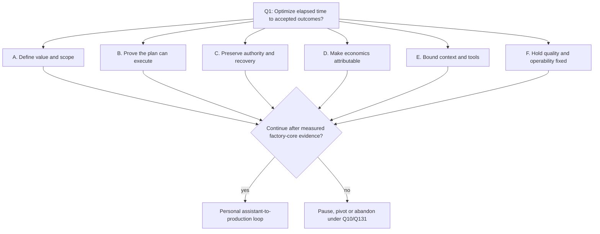

# Twilight grilling decision tree

This is the navigational view of the 160-question Twilight grill. It does not
replace the [answered efficiency corpus](uber-efficiency-grill.md), the
[feasibility questions](claude-feasibility-questions.md), the
[efficiency ranking](claude-efficiency-question-ranking.md), or the
[feasibility plan-impact ledger](claude-feasibility-plan-impact.md). Those files
remain the sources for question text, answers, review reasoning and accepted
plan changes.

The tree orders decisions by dependency. Rank is independent metadata: it says
how useful the independent reviewer found a question, from 1 (least useful) to
5 (most useful). A high rank does not move work ahead of its prerequisites.
Every question has an answer and rank; there is no unanswered decision frontier.
The actionable frontier is the earliest accepted plan obligation whose
prerequisites are ready.

## Coverage

| Corpus                         | Questions | Rank coverage | Source order                |
| ------------------------------ | --------: | ------------: | --------------------------- |
| Efficiency passes              |    Q1–120 |       120/120 | Topic, then question number |
| Feasibility and viability pass |  Q121–160 |         40/40 | Topic, then question number |
| Combined                       |   **160** |   **160/160** | Not rank-sorted             |

The two independent ranking receipts contain exactly Q1–160 once each, with no
gaps or duplicates. The combined distribution is three rank-1, fourteen rank-2,
ninety-two rank-3, forty-one rank-4 and ten rank-5 questions.

## Decision topology

The six branches are concurrent lines of inquiry, not six sequential phases.
Within each branch, however, a later gate depends on the earlier gate above it.
Questions on the same line form one grilling frontier and can be considered
together.

### A. Define value and scope

1. Define the accepted outcome and reject misleading success measures: Q2–Q10.
2. Distinguish factory-core evidence from personal value: Q127–Q128 and Q153.
3. Keep customer machinery behind its named discovery gate: Q159.
4. Price the personal loop and decide when to stop: Q130–Q131.

High-signal leaves are Q2, Q4, Q7 and Q10 (rank 4). Q2, Q4 and Q7 preserve
accepted invariants; Q10, Q130 and Q131 make the planning estimate and go/no-go
decision explicit.

### B. Prove the plan can execute

1. Break bootstrap circularity and probe external dependencies: Q121–Q123.
2. Establish durable-store, readiness and operator-capacity bounds: Q124–Q126.
3. Split work into reviewable slices and measure the host bottleneck: Q129 and
   Q145.
4. Preserve repositories and make release compatibility explicit: Q146–Q152.
5. Bound repeatable acceptance by time, spend and attention: Q160.

The first executable leaf is Q123 (rank 5): Task 1.3 must produce authenticated
ACP/usage evidence and a runtime-class smoke before Task 2. Q160 (rank 5) becomes
actionable at Task 8 acceptance; Q124–Q126, Q129 and Q145 are rank 4. Lower-ranked
portability questions remain settled constraints rather than blockers.

### C. Preserve authority and recovery

1. Keep approval, accounting and capacity authority intact: Q31–Q40.
2. Make backup, upgrade and degraded-operation behavior recoverable: Q132–Q141.
3. Resolve permanent holds without falsifying unknown effects: Q142.
4. Reconcile workspaces and retain reproducible execution inputs: Q143–Q144.
5. Preserve an audited break-glass control path: Q154.

Q132 and Q142 are rank 5. Their order differs: Q142 belongs to Task 4's effect
contract, while Q132 is a Task 13 production-registration gate. Q33 is a rank-4
invariant; Q137–Q138, Q140 and Q143 strengthen owned tasks.

### D. Make economics attributable

1. Define the cost equation and bounded model-routing claim: Q11–Q20.
2. Allocate nested, shared, delayed and converted charges: Q61–Q70.
3. Build representative, isolated and reversible benchmarks: Q71–Q80.
4. Measure reasoning and grounding without proxy inflation: Q88–Q90.
5. Include operator and constrained-resource cost: Q101–Q106.
6. Require payback, evaluation independence and publication authority: Q111–Q120.
7. Measure retention cost before production release: Q158.

Rank-5 leaves are Q11, Q14, Q67 and Q73. The cost ledger in Tasks 4, 7 and 8
must exist before Task 11 can use Q14's per-activity benchmark to change a model
default. Q10/Q131's go/no-go consumes these measurements; it does not precede
them.

### E. Bound context and tools

1. Make grounding, schema loading, batching and polling costs explicit: Q21–Q30.
2. Partition caches and preserve authority through compaction: Q81–Q87.
3. Treat catalog text as untrusted and broker compound effects: Q91–Q100.

Q84 is rank 5. Rank-4 obligations Q21, Q24–Q25, Q29, Q83, Q86 and Q91–Q92
establish the security and attribution boundary that later lazy loading and
compound-effect optimization must preserve.

### F. Hold quality and operability fixed

1. Establish non-vacuous, integration-level acceptance: Q41–Q50.
2. Expose controllable spend and govern feedback loops: Q51–Q60.
3. Bound sensitive operator displays and interruption cost: Q107–Q110.
4. Deliver actionable notifications, accessible emergency controls and safe
   defaults: Q155–Q157.

Q51 is rank 5. Rank-4 leaves Q44, Q48, Q59–Q60 and Q155 ensure that a cheaper or
faster run is not accepted by weakening evidence, hiding spend, or making the
operator poll a dashboard.

## Actionable plan frontier

All decisions are settled, but their accepted effects become executable in task
order. This table is the bridge from review evidence to the single canonical
[delivery plan](../../../openspec/changes/twilight-control-plane/tasks.md).

| When the prerequisite is ready | Action                                                                                                    | High-rank questions                                                  |
| ------------------------------ | --------------------------------------------------------------------------------------------------------- | -------------------------------------------------------------------- |
| Before Task 2                  | Run Task 1.3's provider capability, usage-signal and runtime-class go/no-go probe.                        | Q123                                                                 |
| Tasks 3–4                      | Establish durable SQLite boundaries, attributable accounting, measured overhead and effect recovery.      | Q11, Q21, Q24–Q25, Q29, Q61–Q69, Q91–Q92, Q124, Q142, Q145           |
| Tasks 5–7                      | Expose controllable spend; pin cache, catalog and worker revisions; enforce readiness and reconciliation. | Q33, Q51, Q83–Q86, Q125, Q129, Q137–Q140, Q143                       |
| Task 8 acceptance              | Run fixed-quality real-work proofs within an explicit approval, elapsed-time and spend budget.            | Q2, Q7, Q16, Q44, Q48, Q59–Q60, Q66–Q67, Q126, Q130–Q131, Q145, Q160 |
| Tasks 11–12                    | Benchmark routing and improvement proposals; canary defaults; publish only through human authority.       | Q10, Q14–Q15, Q71, Q73, Q78–Q79, Q84, Q111, Q155                     |
| Task 13 production gate        | Rehearse fresh-host restore and preserve fixed personal-phase acceptance and release authority.           | Q4, Q132, Q160                                                       |

Question IDs may appear in more than one row when an early contract is proved by
a later acceptance gate. The canonical task owns the action; this derived table
does not create a second plan.

## Rank-sorted index

- **Rank 5:** Q11, Q14, Q51, Q67, Q73, Q84, Q123, Q132, Q142, Q160
- **Rank 4:** Q2, Q4, Q7, Q10, Q15, Q16, Q21, Q24, Q25, Q29, Q33, Q44, Q48,
  Q59, Q60, Q61, Q62, Q63, Q66, Q68, Q69, Q71, Q78, Q79, Q83, Q86, Q91,
  Q92, Q111, Q124, Q125, Q126, Q129, Q130, Q131, Q137, Q138, Q140, Q143,
  Q145, Q155
- **Rank 3:** Q1, Q5, Q6, Q8, Q9, Q13, Q17, Q19, Q20, Q22, Q23, Q26, Q27,
  Q28, Q31, Q32, Q34, Q35, Q36, Q37, Q38, Q39, Q40, Q41, Q42, Q43, Q45,
  Q46, Q47, Q49, Q50, Q54, Q55, Q56, Q57, Q58, Q64, Q65, Q70, Q72, Q74,
  Q75, Q76, Q77, Q80, Q81, Q82, Q85, Q87, Q88, Q89, Q93, Q94, Q95, Q96,
  Q97, Q98, Q99, Q100, Q101, Q102, Q103, Q104, Q105, Q106, Q107, Q108,
  Q110, Q112, Q114, Q115, Q116, Q120, Q121, Q122, Q127, Q128, Q133,
  Q134, Q135, Q136, Q139, Q141, Q144, Q146, Q147, Q149, Q152, Q154,
  Q156, Q158, Q159
- **Rank 2:** Q3, Q12, Q18, Q30, Q52, Q53, Q90, Q109, Q113, Q118, Q148,
  Q150, Q153, Q157
- **Rank 1:** Q117, Q119, Q151

The rank index is a review aid, not execution order. Forty-five rank-4 or rank-5
questions resolved to `Strengthen`; six rank-4 questions resolved to `Keep`.
Lower-ranked questions still carry explicit preserve, defer, reject or no-change
dispositions in their source ledgers.
