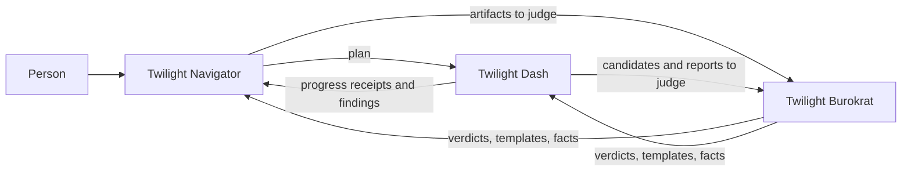

# Names and boundaries

Status: decided by Dany on 2026-09-19. This page is the canonical home for what each name
means and which tool owns which question. Terms are defined in the
[Twilight glossary](CONTEXT.md); this page explains how they fit together. The current
documents were brought into line on 2026-09-20 by the
[rename plan](../superpowers/plans/2026-09-19-twilight-rename.md)'s Tasks 2 to 4. Historical
evidence, research notes and verification records keep the older meaning described under
[What changed](#what-changed), in which a bare "Twilight" means Twilight Dash.

## The naming tree

| Name                   | Short form | What it is                                                                         |
| ---------------------- | ---------- | ---------------------------------------------------------------------------------- |
| Prosperous Unification | PUNI       | The company. It owns everything below.                                             |
| Vesper Shipyards       | none       | Code name for the customer-facing product: the software factory service.           |
| Twilight Structure     | twist      | The suite of tools the product runs on. It contains the three tools below.         |
| Twilight Navigator     | twin       | Planning. Turns a person's request into code structure and a plan for execution.   |
| Twilight Dash          | twid       | Execution. Runs, builds, tests, deploys, generates code and operates environments. |
| Twilight Burokrat      | twib       | Rules. Judges whether every artifact conforms; holds templates and structure.      |

Vesper Shipyards is a code name that is plausible in public and may still change. Only the
registration of its `.com` domain was checked on 2026-09-19; it was unregistered. No trademark
or company-register search has been done.

## Writing the names

Use the full names wherever possible, and always in external or public-facing text: package
pages, release notes, client documents, websites and specifications meant for clients. The
short forms are for internal types, internal notes and command-line binaries.

Inspirations are internal background and stay out of public branding. Twilight Structure is
named after Twilight Sparkle and after Factorio's Low Density Structure, a late-game
ingredient for rocket parts. Twilight Navigator follows the guild navigators of Dune, Twilight
Dash follows Rainbow Dash, and Vesper is Latin for evening and for the evening star. The
shipyard is the metaphor for the factory: the suite is the structural material and the product
is the yard that builds ships from it.

## Three tools, three questions

| Tool               | Question it answers                            | Nature                                                     |
| ------------------ | ---------------------------------------------- | ---------------------------------------------------------- |
| Twilight Navigator | What should be built, in what shape and order? | Works with a person; resolves uncertainty into a plan      |
| Twilight Dash      | How does the plan become running software?     | Dynamic: takes time, holds credentials, changes the world  |
| Twilight Burokrat  | Is this artifact allowed and complete?         | Static: a function of a Git revision and recorded evidence |

A one-line test places any new responsibility. If the question can be answered from a Git
revision plus recorded evidence, with no side effects, it belongs to Twilight Burokrat. If
answering it takes time or changes something, it belongs to Twilight Dash. If it needs a
person to decide, it belongs to Twilight Navigator.

The static side carries a security property. Twilight Burokrat needs no credentials, no
network and no clock, so anyone can rerun it and obtain the same verdict. That is what lets it
act as the trusted gate. Twilight Dash holds the secrets and performs the effects.

### How the split settles the edge cases

- **Tests.** Running tests is Twilight Dash. The rules about test levels, scenario citations
  and the coverage join are Twilight Burokrat, because a test report is an artifact at rest.
- **Templates and code generation.** Twilight Burokrat owns each template and its
  conformance rule. Twilight Dash instantiates the template and Twilight Burokrat verifies
  the output. A template has one home, so the generator and its validator cannot drift.
- **The work request flow.** Twilight Navigator shapes the request, the specification and the
  plan with the person. Twilight Dash moves work between stages. Twilight Burokrat gates the
  artifacts of every stage.
- **Leases and admission.** An admission verdict is a static judgment and stays with Twilight
  Burokrat. Lease acquisition, heartbeats and fencing are runtime state and belong to
  Twilight Dash. Today both live in the Burokrat package; moving the lease authority is the
  one migration this split implies.
- **The verifier tool.** The control-plane design planned a separate Twilight compile and
  verify tool. Its verification half is Twilight Burokrat's work and its compile half is
  Twilight Dash's. No separate tool is created.

## How the tools depend on each other

- Twilight Burokrat depends on neither of the others. That keeps it a pure judge.
- Twilight Navigator and Twilight Dash both depend on Twilight Burokrat for templates,
  structure and quick validation of artifacts.
- Twilight Navigator and Twilight Dash exchange records, not calls. A plan goes one way.
  Progress receipts and findings come back. The glossary already names these records: plan
  lock, progress receipt and planning broker. Both are artifacts Twilight Burokrat validates.
- A fast loop uses the same records at a faster cadence. When execution discovers missing
  scope, Twilight Dash emits a finding and Twilight Navigator replans. A direct interface is
  added only if measurement shows the artifact round trip is too slow.

Twilight Dash and Twilight Burokrat exchange three records through a shared contracts
library:

| Record                  | Direction        | Content                                                                          |
| ----------------------- | ---------------- | -------------------------------------------------------------------------------- |
| Candidate               | Burokrat to Dash | Source identity, verdict, affected deployables, migration and environment facts  |
| Environment observation | Dash to Burokrat | Environment identity, served artifact, source and configuration revision, health |
| Report                  | Dash to Burokrat | A test run or manual sweep bound to one candidate or one environment observation |

Two refusals make the pair safe. Twilight Dash does not promote a candidate without a current
verdict. Twilight Burokrat does not count a report whose environment observation does not
match the candidate.

## Where existing things land

| Existing thing                                                       | Owner after the rename                                   |
| -------------------------------------------------------------------- | -------------------------------------------------------- |
| The wiki ledger, policy, activation and review provenance            | Twilight Burokrat, unchanged                             |
| The lease authority inside the Burokrat package                      | Twilight Dash, after a planned migration                 |
| Glossaries, ADR rules, OpenSpec schemas and artifact templates       | Twilight Burokrat                                        |
| The control plane: coordinator, workers, effect execution            | Twilight Dash                                            |
| Fleet, deploy, image build, compose, smoke, bootstrap, secrets tools | Twilight Dash, first as a facade over the existing tools |
| Discovery, grilling, assumptions, specification with a person        | Twilight Navigator                                       |
| Work planning, dependencies, capacity                                | Twilight Navigator, using WBS as its planning surface    |
| The secretary conversation for software requests                     | Twilight Navigator's front door                          |
| WBS                                                                  | Stays its own product; Twilight Navigator uses it        |

The sixteen stages of the [Twilight SDLC](sdlc-stages.md) divide the same way. Request,
discovery, specification and planning are Twilight Navigator's. Implementation through release
are Twilight Dash's. The artifact gate of every stage is Twilight Burokrat's.

## What changed

Until 2026-09-19, "Twilight Structure" named the software factory service itself, which is now
two things: Vesper Shipyards is what a customer buys, and Twilight Dash is the runtime that
executes the work. In a document dated before 2026-09-19, read "Twilight Structure" or a bare
"Twilight" as Twilight Dash unless the passage is about planning with a person, which is now
Twilight Navigator, or about rules and evidence, which is Twilight Burokrat.

Review receipts, research notes and stored evidence are historical snapshots and keep their
original wording. Stored evidence identities, version-1 record and module identifiers, role
filenames and the legacy wiki environment variables keep their spelling, as the
[Burokrat package](../../apps/twilight-structure/twilight-burokrat/cli/README.md) already requires.
