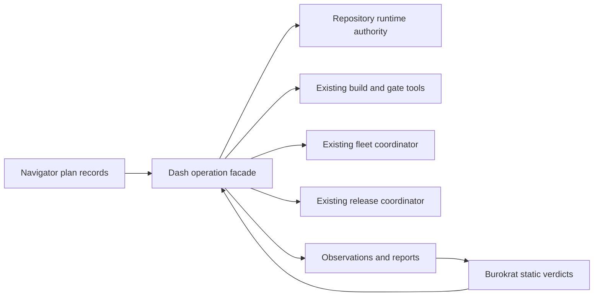

# Twilight Dash facade and lease authority

Status: architecture recommendation for WBS 080.19, 2026-09-30. Decisions below
await the operator's design interview. This note authorizes no implementation,
authority activation, infrastructure mutation or production cutover.

## Intent

Expose the existing build, fleet and deployment capabilities through Twilight
Dash, and move runtime admission ownership out of Twilight Burokrat without
losing claims, publication recovery or fencing. Success means one identifiable
runtime owner, reproducible static verdicts, and a tested recovery path through
the handoff. Preserve existing tools, evidence identities and production safety
contracts. Exclude a scheduler implementation, automatic provisioning, tool
renaming, a database-engine change and production cutover.

## Evidence and the present boundary

Inspected local `main` at `4bb71e5fdf7f753b9a67ce7dd56abff387ce3a29`.
The [names and boundaries](../../twilight-structure/names.md) already assign
runtime leases and existing tools to Dash. The
[control-plane design](../../../openspec/changes/twilight-control-plane/design.md)
explicitly leaves the lease migration open. The
[September 17 delivery contract](../../superpowers/specs/2026-09-17-twilight-burokrat-and-fleet-design.md)
supersedes the September 15 proposal's tentative release sequencing: a
journaled coordinator controls WBS; Flux ordering alone is insufficient.

| Authority today                   | Inspected implementation                                                                      | Boundary to preserve                                                                                                                                       |
| --------------------------------- | --------------------------------------------------------------------------------------------- | ---------------------------------------------------------------------------------------------------------------------------------------------------------- |
| Repository claims and publication | Burokrat `src/admission/{authority-store,claims,generations,submit,integrate,publication}.ts` | One SQLite authority per common Git directory; path/group conflicts, generations, packet bindings, integration queue and publication recovery share state. |
| Fleet membership mutation         | `tools/tool-fleet/src/{apply,production-apply}.ts`                                            | Per-cluster operation Lease, identity/precondition re-observation, journal and mutation-boundary checks.                                                   |
| WBS release                       | `tools/tool-deploy/src/k8s/{release,execute,journal}.ts`                                      | Release Lease and journal, Flux suspension ownership, write fencing, captured migrations and explicit rollback outcome.                                    |
| Heavy build/gate capacity         | `bin/h2puni-gate.sh` contract in `LLM_README.md`                                              | Host-wide heavy lock remains mandatory; a Dash reservation does not replace it.                                                                            |

The repository store is `module-wiki-authority.v5` under the common Git
directory's `module-wiki/authority.sqlite`. It holds both generations and
integration records; `transactPublication` deliberately holds its writer lock
across a non-replayable Git publication callback. `submit-admission` in
Burokrat's CLI opens and mutates that store. This is more than moving a heartbeat
function. [ADR 0021](../../adr/0021-shared-git-admission-authority.md) chooses a
cooperative local authority and explicitly excludes a distributed multi-clone
service. It does not promise to prevent editing-time filesystem writes.

The present store can initialize an absent database. A migration must therefore
distinguish an explicit new-authority bootstrap from opening an expected existing
authority: absence during adoption cannot silently create an empty successor.
The source comment also says activation awaits separately reviewed bootstrap;
this inspection did not establish whether any installation has activated it.

## Recommended shape and alternatives

Choose an in-repository Dash application facade with typed, versioned operation
records and adapters to the existing tools. Move the cohesive repository runtime
authority into Dash-owned modules, preserving its storage location and protocol
initially. Keep Burokrat's validators, trusted activation, ledger and immutable
evidence semantics under Burokrat ownership. Split mixed modules by effect:
candidate composition and publication orchestration belong to Dash; static
candidate/evidence judgment belongs to Burokrat. Shared contracts contain records
and validation shapes, never the runtime store or credentials.

Two alternatives have real costs. A command alias alone is inexpensive but
leaves runtime ownership inside Burokrat. A network authority service could
support multiple clones and hosts, but adds authentication, availability,
partition and storage-migration contracts that ADR 0021 deliberately deferred.
Do not introduce that service as an incidental consequence of the rename.

The facade should expose plan, apply, observe and recover operations for each
supported capability; it must not offer arbitrary shell execution. A plan binds
the source/candidate identity, adapter version, target identity, input digests,
expected effects and required evidence. Apply names the immutable plan and
digest. Dash checks current authorization and verdict applicability immediately
before dispatch; adapters retain their existing finer-grained safety checks.
Build remains Dagger to the registry, and production promotes the exact staged
digests. Source-run dev retains its own deployment path.

Each effect receives a stable identity and a durable dispatch intent. A repeated
request first observes the previous attempt. A lost response becomes an explicit
unknown outcome requiring reconciliation, never automatic success or an
unconditional second invocation. Adapter journals remain authoritative for their
internal transaction phases; Dash records their identities and outcomes rather
than inventing a parallel release state machine.

Repository generations, fleet operation Leases, WBS release Leases and the host
heavy lock remain different scopes. Do not convert them into a universal lease
or imply that acquiring one grants the others. Future attempt authority follows
the control-plane contract and stays outside the replaceable worker cluster.

## Migration and convergence

1. Inventory deployed callers, binaries, activations and actual authority stores.
   Establish whether the authority has ever been activated; inspect canonical
   paths, schema, outstanding generations and publishing records. Stop on unknown
   state. Produce a handoff manifest binding the repository and supported versions.
2. Create an OpenSpec packet after the scope decision: intent, delta scenarios,
   technical design, ordered TDD slices and factual `verify.md`. Introduce shared
   contracts and facade adapters with unchanged existing tool behavior first.
3. Extract runtime authority with its transaction and recovery tests as one
   cohesive unit. Retain `module-wiki` paths, generation sequences, packet bytes,
   publication markers and activation identities. Do not copy only active leases
   into a fresh database or dual-write two stores.
4. Rehearse an attended handoff. Stop admission and old runtime writers, resolve
   or explicitly preserve recoverable publications, take a consistent backup,
   and validate Dash against the same authority. Keep admission closed until the
   exact supported binary and state pair passes recovery checks. Do not assume
   that waiting for heartbeat expiry proves writers stopped.
5. Prevent old runtime binaries from becoming writers again through the trusted
   launcher/install boundary. Retire `submit-admission` from Burokrat with a
   specific replacement-command diagnostic; never fall back to embedded runtime
   code when Dash is missing. Whether a compatibility launcher is needed is an
   operator decision; it must live outside the pure Burokrat dependency graph.
6. Open admission through Dash, record the exact handoff and verify one resumed
   generation and one recoverable integration. If no live authority existed,
   use explicit bootstrap instead and do not claim a live migration was proved.
   Rollback first stops Dash writers, validates backward state compatibility and
   reconciles Git publication markers. A backup must not erase publications or
   generations accepted after handoff. Never run old and new owners concurrently.

Keeping the existing schema avoids an unnecessary storage migration, but does
not itself fence old executable code. If the deployment cannot enforce a single
writer implementation, a versioned persistent writer fence and its upgrade path
must be designed before handoff; the current v5 store must not be assumed to
provide that new capability.

## Failure and security boundaries

Required tools, trusted pins, state and observations fail closed when missing,
unreadable, malformed or stale. Contention and retries have explicit bounds.
Clock regression, stale generation, revoked authority and lost lease prevent
new mutations. Already dispatched effects remain subject to reconciliation;
release/fleet adapters retain control of rollback and recovery. A failed WBS
rollback preserves its blocked phase and manual completion command.

Trusted runner configuration selects executables and credential scope. Candidate
code cannot choose the privileged adapter, policy pin, clock or target. Worker
Jobs and candidate PR execution receive no production credentials or writable
authority database. Reports bind exact candidates and environment observations;
logs and receipts exclude secrets. Burokrat's static judgment must run without
runtime authority, network credentials or a live clock. A separate service, if
chosen later, needs an authenticated boundary; local SQLite contention alone is
not protection from a hostile same-user process.

## Acceptance criteria for the implementation packet

| Scenario                        | Required observation                                                                                                                                                                       |
| ------------------------------- | ------------------------------------------------------------------------------------------------------------------------------------------------------------------------------------------ |
| Facade plan and exact apply     | Planning reaches no mutation adapter; changed plan digest, target or stale verdict causes zero mutations.                                                                                  |
| Authority relocation            | Existing generation, packet and queue identities survive; an overlapping claim is refused across two linked worktrees.                                                                     |
| Missing versus unreadable state | Adoption of an absent store refuses without creating it; unreadable and malformed stores report distinct failures. Explicit bootstrap is tested separately.                                |
| Old writer and expiry           | An old entrypoint cannot write after handoff; a resumed stale generation cannot heartbeat, submit or publish; expiry does not reassign a reachable workspace.                              |
| Publication crash recovery      | Interrupt before and after Git ref publication; reopening reconciles the existing marker once, retains claims correctly and does not duplicate publication.                                |
| Remote response loss            | Interrupt after a fleet/build/deploy dispatch; retry observes and reconciles the same effect identity instead of dispatching a second mutation.                                            |
| Independent lease scopes        | Dash admission does not bypass a held fleet/release Lease or heavy lock; loss during adapter execution stops further mutations.                                                            |
| Static trust boundary           | Burokrat judgment yields the same verdict from the same recorded inputs with runtime store, clock and network unavailable; candidate edits cannot select privileged policy or executables. |
| Rollback                        | Rehearsed handoff reversal preserves the accepted generation sequence and Git publications; incompatible state refuses rollback visibly.                                                   |

For each new or changed guard, observe the production-path negative fail when
the guard is removed or its dependency broken, then record the injected fault
and failing assertion beside `Proof:` and in `verify.md`. Existing test names
and historical passes alone do not satisfy that requirement.

## Operator decisions, in interview order

1. Is this an in-repository facade and local authority relocation, or also a
   deployed multi-host service? Recommend the former; a service revisits ADR 0021.
2. Which installations and callers must survive the handoff, and is a brief
   admission pause acceptable? Recommend an attended pause and explicit old
   writer retirement; the deployment inventory must supply facts first.
3. Must old `submit-admission` clients keep working? Recommend an explicit
   migration diagnostic unless actual callers require a separately versioned
   compatibility launcher.

Ask the first decision, obtain the answer, then follow its branch. These are
recommendations, not accepted decisions. No new glossary term was resolved, so
neither root nor Twilight `CONTEXT.md` was changed and no ADR was invented.

## Branches and evidence limits

Relevant local branches observed: `batch-9/080-20-mcp-k3s` at `b74144253`,
`batch-9/k3s-rehearsal-main` at `c45ccd4dd`, and
`fix/k3s-lab-previous-log`; a remote-tracking
`origin/change/twilight-bureaucrat-fleet` also exists. No refs were fetched and
no branch tips were checked out. Local history contains QEMU fix `f72604490`
and MCP rehearsal `d1e4ac07`.

The parent task reports predecessors 070.11 and 080.26 done. The checked-in
[MCP rehearsal record](../../../openspec/changes/k3s-wbs-delivery/verify.md)
documents 38 passing live-lab assertions and production image/Secret limits.
The [QEMU wait record](../../../openspec/changes/qemu-lab-start-wait/verify.md)
documents focused negatives and 16 passing tests, an unrelated fleet-suite
timeout, and no live QEMU run for that change. Those records support planning
readiness; they do not prove a production authority or deployment is ready.

This review ran local source/document and Git inspections only. No authority
store, live host, cluster, registry, credentials or deployed caller was inspected.
No code tests, fault injections, live rehearsals or h2puni full gate were run.
This is a decision-ready note; WBS 080.19 implementation remains open.
