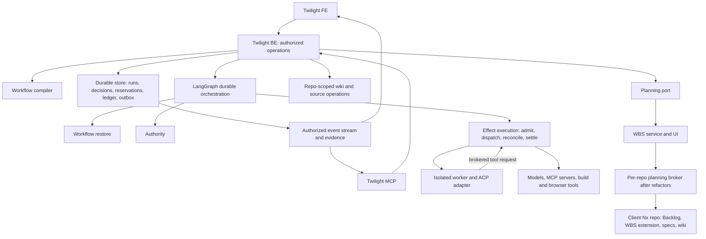

# Twilight control plane

Status: proposed architecture for staged implementation, 2026-09-06. The first
increment (M1 in [tasks](tasks.md)) is the shared FE/BE/MCP execution loop. Read
the [assumption ledger](../../../docs/twilight-structure/assumptions.md) and the
[research index](../../../docs/twilight-structure/README.md) before implementation.
Normative MUSTs live in the [control-plane spec](specs/twilight/control-plane/spec.md);
this document explains the mechanism and is not a second copy of the rules.

## Boundaries



Twilight owns workflow execution and authority. WBS owns its planning semantics.
Backlog.md and its versioned extension own planning persistence after the migration.
OpenSpec owns requirements and artifact contracts. The wiki owns sourced explanations.
These are logical boundaries; the first service does not need a process per box.
The worker has no path to the outside except a brokered request that passes
through effect execution; egress and credential policy live in the coordinator.

Proposed Nx units, created with the behaviour that first needs them:

| Unit                      | Responsibility and dependencies                                                           |
| ------------------------- | ----------------------------------------------------------------------------------------- |
| `libs/twilight-contracts` | Validated commands, errors, events, configuration and adapter capability documents        |
| `libs/twilight-domain`    | Pure transitions, authority predicates, finding dispositions, resource accounting         |
| `libs/twilight-runtime`   | LangGraph/checkpointer, durable store, ACP and evidence adapters behind precise ports     |
| `apps/twilight-be`        | Elysia authenticated operations, repository access, streams and orchestration composition |
| `apps/twilight-fe`        | React/Vite run/configuration/decision views, focus brief, WBS integration                 |
| `apps/twilight-mcp`       | Streamable HTTP MCP facade over the same BE operations and caller authority               |
| `apps/twilight-worker`    | Isolated activity host; no access to control-plane credentials or policy writes           |
| `tools/tool-twilight`     | Nx-driven compile, inspect and verify operations sharing the same libraries               |

Do not import WBS app internals to obtain convenient code. Reuse existing shared
auth/validation/observability only after reading its callers and tests and proving
the contract. Existing [MCP forwarding](../../../apps/mcp-01/README.md) is a
pattern, not permission to reuse a process-wide token.

### Invariant ownership

Three deep modules own the ordering that makes the runtime safe. They are internal
boundaries in `twilight-runtime`, not services:

| Module           | Public operation                                                      | Invariants hidden from callers                                                                                                                                                |
| ---------------- | --------------------------------------------------------------------- | ----------------------------------------------------------------------------------------------------------------------------------------------------------------------------- |
| Workflow restore | `restoreRun(runId)`                                                   | Resolve retained executable closure, check checkpoint/store compatibility, load state, reconcile revisions, then permit resume.                                               |
| Authority        | `authorizeAction(request)`                                            | Intersect pinned scope and approval with current identity, grants and safety floors; return a revision-bound decision consumed inside admission/dispatch.                     |
| Effect execution | `admitActivity`, `dispatchEffect`, `reconcileEffect`, `settleAttempt` | Reserve resources, validate authority and attempt fence at dispatch, persist intent/outcome, reconcile uncertainty and release each resource only with its terminal evidence. |

BE routes, graph nodes, workers and hooks call these operations. They cannot load a
checkpoint and decide compatibility themselves, assemble policy predicates, invoke
provider transports, or free leases directly. An authorization response is not a
reusable bearer grant: effect execution validates current revisions at the dispatch
boundary. Store, transport and launcher ports stay private to these modules; tests
exercise the public operations with independent effect and resource observations.

## Single workflow source

The repository's OpenSpec schema is the artifact dependency source. The
[execution profile](../../../openspec/schemas/twilight-v1/execution.yaml) beside it
maps artifacts onto stages, declares activities, assigns policies to lifecycle points,
registers hooks and defines delivery profiles. The compiler consumes schema,
templates, execution profile, repository manifest, provider capability documents and
referenced skill/prompt versions. It produces a content digest, the resolved
lifecycle graph, effective policies with their origins, artifact requirements,
capabilities and schema-driven configuration forms. Unknown fields, missing or
unreadable required inputs, cycles, unsupported controls and a profile below the
repository floor are compile errors.

The mapping is versioned and contract-tested. This pilot's schema has no automatic
enforcement; the first custom tool is the narrow compiler/verifier. Do not build a
generic workflow language, a whole wiki database or a provider SDK before the
compiler and the first durable loop show what is missing.

## Stages, activities and the execution profile

The stage vocabulary is one list, owned by `execution.yaml` and reproduced in
[SDLC stages](../../../docs/twilight-structure/sdlc-stages.md): `request`,
`discovery`, `specification`, `planning`, `implementation`, `review`,
`verification`, `acceptance`, `handoff`, and the separate `release` command.
Artifact ids map onto stages; a stage may exist without an artifact of its own
(`review`) and an artifact may serve several stages (`verify`). Activities are
declared in the profile under their stage with a class (`research`, `plan`,
`implement`, `review`, `judge`, `verify`, `knowledge`). Adding an activity never
requires a new Markdown artifact.

Lifecycle points are the one key space for policies and hooks. A point is
`<event>.<stage or activity id>`, with `*` matching all. Events: `beforeStage`,
`afterStage`, `beforeActivity`, `afterActivity`, `beforeTool`, `afterTool`,
`onFinding`, `onApproval`, `onRework`, `onFailure`, `onCancel`, `onTrigger` and
`onProfileChange`. Artifact ids are never policy keys, and the profile carries no
dependency edges; those stay in the schema.

A hook registration names an implementation and version, the points it attaches
to, whether it is mandatory, its timeout and timeout behaviour, its declared
capabilities and its idempotency class. Registered implementations and sandboxed
commands are the only kinds in the first release.

Policy scope, most general first: platform floor, organization floor, repository
(`execution.yaml`), workflow revision, activity, run. Each level may narrow the
level above; nothing loosens a floor. A run override is a field of the request's
profile selection and carries a reason. Per-tool policy is a `beforeTool.<activity>`
point. Presentation is a per-actor preference, not policy, and sits outside the
chain. Platform and organization floors, capacity pools and the rate card are
server records edited through their own privileged operations, listed below.

## Commands and shared contracts

All writes accept a client-generated idempotency key and an expected entity revision.
The server derives actor and authorization scope from verified caller identity.
Opaque string identifiers are validated at the boundary; repository identity is
stable and separate from a filesystem path or remote URL. Illustrative contracts
for the first increment (the runtime schema is their source):

```ts
type CommandScope = {
  repositoryId: string;
  idempotencyKey: string;
};

type ProfileSelection = {
  name: string;
  revision: string;
  overrides: Partial<DeliveryProfile>;
  reason: string | null;
};

type SubmitRequest = CommandScope & {
  title: string;
  outcome: string;
  workflowRevision: string;
  profile: ProfileSelection;
  plan: PlanRef | null;
  discoveryEnvelope: string | null;
};

type PlanRef = {
  repositoryId: string;
  planId: string;
  changeId: string;
  planningCommit: string;
  sourceBaseCommit: string;
  requirementsDigest: string;
};

type DecideApproval = CommandScope & {
  approvalId: string;
  expectedRevision: number;
  subjectDigest: string;
  decision: 'approve' | 'reject';
  reason: string;
};

type RunCommand = CommandScope & {
  runId: string;
  expectedRevision: number;
  action:
    | { kind: 'pause' | 'resume' | 'cancel' }
    | { kind: 'retry'; activityId: string }
    | { kind: 'skipActivity'; activityId: string; reason: string }
    | { kind: 'changeProfile'; profile: ProfileSelection };
};

type UsageObservation =
  | {
      status: 'measured';
      inputTokens: number;
      outputTokens: number;
      cacheReadTokens: number | null;
      estimatedCost: Money | null;
      billedCost: Money | null;
    }
  | { status: 'unavailable'; provider: string; reason: string };
```

A `null` plan means discovery has no work plan yet and cannot pass implementation
admission. `discoveryEnvelope` names an envelope from the profile; `null` selects
manual authoring only, and automated discovery admission is refused until an
envelope is chosen. `estimatedCost` is tokens times the rate-card entry pinned at
admission and is `null` only when no entry exists, which a strict money budget
refuses at admission. `billedCost` is the provider's figure when it reports one.
Invalid trusted persisted records throw; modeled request, permission and conflict
failures return typed responses.

| BE operation                                    | MCP operation          | FE entry                             | Owner  |
| ----------------------------------------------- | ---------------------- | ------------------------------------ | ------ |
| `POST /api/repositories/:id/requests`           | `submit_request`       | Repository → New request             | Task 3 |
| `PUT /api/runs/:id/artifacts/:kind`             | `revise_artifact`      | Workbench editor                     | Task 3 |
| `POST /api/runs/:id/plans`                      | `adopt_plan`           | Validate and select a complete plan  | Task 3 |
| `GET /api/runs/:id`                             | `get_run`              | Run detail                           | Task 3 |
| `GET /api/runs/:id/events?after=cursor`         | `list_run_events`      | Timeline / reconnect                 | Task 7 |
| `POST /api/runs/:id/commands`                   | `command_run`          | Pause, resume, cancel, retry, skip   | Task 3 |
| `POST /api/approvals/:id/decisions`             | `decide_approval`      | Approval diff                        | Task 3 |
| `POST /api/decision-tokens`                     | none (browser only)    | Approval confirmation                | Task 3 |
| `POST /api/repositories/:id/workflows/validate` | `validate_workflow`    | Draft preview                        | Task 5 |
| `POST /api/repositories/:id/workflows`          | `publish_workflow`     | Publish configuration                | Task 5 |
| `GET /api/repositories/:id/policy?scope=`       | `get_effective_policy` | Effective value, origin, restriction | Task 5 |
| `PUT /api/organizations/:id/floors`             | `publish_floor`        | Organization floors (privileged)     | Task 5 |
| `GET /api/repositories/:id/capacity`            | `get_capacity`         | Queue and pool view                  | Task 4 |
| `PUT /api/organizations/:id/capacity`           | `set_capacity`         | Pool sizing (privileged)             | Task 4 |
| `PUT /api/organizations/:id/rate-card`          | `publish_rate_card`    | Rate card (privileged)               | Task 4 |
| `GET /api/runs/:id/ledger`                      | `read_ledger`          | Run cost and time                    | Task 4 |
| `GET /api/repositories/:id/outcomes`            | `read_outcomes`        | Profile comparison                   | Task 7 |
| `GET /api/evidence/:id`                         | `read_evidence`        | Evidence detail                      | Task 7 |
| `POST /api/effects/:id/resolutions`             | `resolve_effect`       | Recovery inbox                       | Task 4 |

Privileged operations need the organization administrator capability and are
themselves revisioned and evented. Bootstrap (organization id, issuer, member and
repository bindings) is a trusted operator command, and its resulting bindings are
readable through `get_effective_policy`; bootstrap is not exposed to agents because
it establishes the authority every other operation checks.

### Human decisions

The [spec](specs/twilight/control-plane/spec.md) states what a human decision must
be bound to and how single use behaves. The mechanism:

- M1 uses `libs/auth`'s OIDC/JWKS primitives with a separately configured Twilight
  client and audience. The browser login is authorization code with PKCE, state and
  nonce validation and a durable server-side session on a hardened cookie (A30).
- `POST /api/decision-tokens` requires that session, same-origin/CSRF checks and
  confirmation of the displayed action and subject digest. It records a short-lived,
  single-use token bound to actor, organization, repository, action, subject,
  expected revision, expiry and intended consumer.
- Consuming the token and committing the decision is one transaction, and the token
  is then bound to the committed command identity (actor, consumer, repository,
  idempotency key, canonical parameter digest). An exact retry returns the stored
  receipt; a different command or different parameters is refused (A42).
- The token may be handed to the authorized MCP client for that exact action.
  Agents never receive the browser cookie or the mint capability. Twilight MCP
  verifies its own audience and never forwards that token to BE; it uses issuer
  token exchange or a service credential carrying the verified actor (A36).

### Artifacts and configuration publication

Artifact edits carry expected artifact and run revisions, content digest, kind,
source basis and author. They live in an isolated draft workspace and
content-addressed storage until published as a source candidate. Discovery agents
and people use the same `revise_artifact`; `adopt_plan` validates capabilities,
design applicability, task/dependency/resource contracts and source basis before
minting a plan reference and requesting implementation approval.

Repository workflow files are the authored configuration source. Publication
carries an expected source revision, validates a draft diff, and publishes a
repository candidate commit through a serialized compare-and-swap. The compiled
snapshot is an immutable index of that commit and package closure. A clean
checkout at that revision compiles to the same digest. Activation is an explicit
server record; a Git edit alone activates nothing. Active runs keep their pinned
snapshot; current authority still constrains them (next section).

## Durable execution and effect ownership

The first topology is one active coordinator with a separate durable SQLite store
and a restart-tested LangGraph JS checkpointer. The store's migrations run through
be-01's runner extracted into a shared library, under the same `down.sql` rule and
lint (A38). Task 1 pins actual compatible packages, including the LangGraph floor
that node timeouts and cooperative drain need, and chooses synchronous
checkpointing unless the driver's crash tests justify otherwise. Never use an
in-memory saver in acceptance. Horizontal coordinators wait for leases and
transactional admission to pass races.

Persist request, run, stage and activity attempts, decisions, findings and
verdicts, reservations, effect intents, ledger entries, evidence metadata and
outbox records, each with a monotonic revision and transition id. The application
transaction commits an authorized transition plus its outbox entry; the graph
consumes it by that id, and checkpoints reference the transition revision. A
crash between the two writes is recovered through outbox and revision
reconciliation, not a transaction pretending to span two databases.

### Executable compatibility and upgrades

Each run retains a compatibility manifest beside its compiled digest: controller
and graph build, compiler version, Bun and dependency lock digest, checkpoint
serializer and saver versions, store schema, and each hook and adapter
implementation digest with its protocol. Configuration pins alone are not enough;
the executable package closure is retained for every resumable run.

`restoreRun` verifies availability, readability, integrity and supported
compatibility before loading a checkpoint. An absent package, changed hook,
unknown serializer or incompatible schema blocks resume with a specific reason and
zero dispatches; a hook name is never resolved to its latest implementation for an
old run. The first increment may refuse an upgrade while incompatible nonterminal
runs exist and does not promise to host every historical graph. Upgrade rehearsal
holds admission, settles or fences outstanding attempts and reconciles store,
outbox and checkpoint at a named transition. Rollback uses a retained compatible
executable and a tested reverse migration of both stores; if accepted decisions or
effects cannot be preserved, rollback is refused and the paused recovery route is
kept. The protected recovery command runs without the new controller being healthy.
Successful migration and rollback proofs per supported path are Task 14's contract.

### States, attempts and leases

Run state is a tagged union: `queued`, `running`, `awaiting_approval`, `paused`,
`reconciling`, `failed`, `cancelled`, `completed`. A run is `reconciling` while any
of its effects has outcome `unknown`. Admission outcomes are `queued`, `admitted`,
`denied`; effect outcomes are `succeeded`, `failed`, `unknown`; a reservation is
`held`, `draining` or `released`. Stage conclusions carry `current`, `stale` or
`inapplicable` with a policy reason, and a skipped activity records the decision
and reason that skipped it. Each retry is a new attempt under the same activity.

LangGraph uses one thread per run. Side-effecting work sits behind durable effect
ids with a checkpoint before each irreversible boundary; an interrupted node may
replay, so its preamble must not launch a worker or emit an effect without
deduplication ([runtime findings](../../../docs/twilight-structure/research/runtime-patterns.md)).

A lease has an owner, a fencing token and a deadline. Expiry withdraws authority
and proves nothing about whether the process, remote session or resource stopped.
Every brokered tool and effectful hook passes through `dispatchEffect`, which
revalidates fence, lease, current authority and cancellation for the persisted
intent inside one serialized coordinator boundary. A request queued before a
revocation but not yet admitted is refused; an effect already dispatched is
reconciled or cancelled, never unsent. New effect keys do not bypass attempt
fencing. Source writes happen only in the attempt's isolated workspace, and a
writable mount is never reused while an old writer can reach it.

Effect intent is recorded before dispatch: logical key, parameter digest, attempt
fence, authority revisions, target and the provider's idempotency support. On an
unknown outcome the provider's receipt or query contract reconciles it; without one
the effect stays `unknown` and needs a modeled operator resolution. Cancellation
fences, stops or drains, collects terminal evidence per resource, then releases
proven-free reservations; `settleAttempt` owns that accounting across restarts.
Local process exit is evidence for that process only. Budget holds settle against
measured usage or stay explicitly unresolved; exit does not make spend zero.

`resolve_effect` needs the recovery-operator capability, expected effect and run
revisions, evidence references, and one of `confirm_succeeded`,
`confirm_not_applied` or `abandon_unknown`. A fresh attempt after
`confirm_not_applied` needs evidence that the effect did not occur and a new
admission. `abandon_unknown` ends dependent automatic work and keeps the outcome
unknown. Conflicting resolutions return 409; ordinary resume cannot bypass this.

## Policy, hooks, review and capacity

At each admission and again at effect dispatch, Authority intersects the pinned
requested scope and approval with current actor, membership and repository grants,
approval expiry and revocation, integration grants and the current floors. A
tightening applies to existing runs without migrating their definition; a
relaxation never enlarges an old approval, and broader work needs a new subject
and decision. The run shows the changed authority reason beside the pinned
definition. Data from a wiki or a tool response cannot alter policy, and missing
or invalid policy blocks admission.

The approval subject digest covers the full dependency closure: specs, design,
planning revision, compiled workflow and policy, delivery profile revision with any
run overrides, budget, environment and requested capabilities. Changing any of
them marks dependent verdicts and evidence stale; a monotonic subject revision
stops an old in-flight decision from becoming current again after an A→B→A edit.
Approvals expire and can be revoked, with in-flight behaviour explicit per action
class.

Mandatory hooks return typed allow/deny/error and deny on timeout; optional hooks
may report `degraded` visibly. Critics inspect evidence within read scopes and hold
no decision authority; judges assess attributed findings against pinned, versioned
rubrics; a safety critic is a critic with a safety rubric, not a separate authority.
Authors never judge their own deliverable. Dissent is kept. The number of critics,
whether a judge runs and the revision-round limit come from the delivery profile;
exhausting the rounds pauses the run with the finding, consumed budget and next
authorized action visible.

ACP adapters advertise session load and resume, cancellation, permission
interception, MCP transport support, usage signals and tool-event coverage.
A required control the adapter lacks is enforced outside it or makes the
workflow inadmissible, and compile-time validation names the gap.

Admission reserves a vector atomically before launch: agent slots, provider and
model rate and token limits, workspace writer ownership, build and browser slots,
and the profile's budget. Starting counts as occupied. Queue order is
deterministic priority plus aging with per-client ceilings; one reviewer slot is
reserved when fan-out could exhaust worker capacity. Paused human decisions hold
no worker. Measured consumption reconciles against reservations and never
overwrites estimates; unknown signals carry source and reason. Human effort,
elapsed queue time and WBS workdays stay distinct quantities (A12).

## Levers, ledger and outcomes

The levers a person tunes are cost in money and time, model choice, review and
verification depth, skipped activities and fan-out. Four objects make each lever a
setting with a feedback loop, all versioned and inspectable through FE, BE and MCP:

- **Delivery profile.** A named bundle in `execution.yaml` `profiles`: model and
  effort per activity class with an escalation ladder (cheaper first, escalate on
  refusal, gate failure or blocking finding, bounded steps), review depth, verification
  tiers and browser-gate mode, skipped activities, fan-out, budget in tokens, money
  and elapsed time, and a deadline. A request selects one and may override fields
  downward with a reason; a run may change profile mid-flight through `command_run`,
  which is an `onProfileChange` event so cost curves split at the boundary. Skipping
  an activity the profile includes is a recorded decision. Nothing overrides the
  repository floor or an organization floor.
- **Rate card.** Per provider and model revision: input, output and cache prices
  with an effective date, published by the organization. Estimated money is tokens
  times the entry pinned at admission. Provider-billed cost reconciles against it and
  never overwrites it. A money-budgeted profile whose models have no entry fails
  compilation; a strict budget refuses admission without one.
- **Run ledger.** Per activity attempt: planned, reserved and measured tokens, money,
  agent elapsed time, queue wait, human wait and human minutes, the model that
  actually served the attempt, the escalation step if any, and the profile revision
  in force. Aggregates roll up to run, request and repository.
- **Outcome record.** Per run and candidate: accepted or not, rework rounds,
  findings by severity, gate failures, activities skipped and by whom, escaped defects
  reported within the configured window, and estimate versus actual per task. Each
  record names the profile revision, so `read_outcomes` can compare cost, time and
  quality across profiles and answer whether a cheaper model or a skipped review
  cost more in rework than it saved.

A quality figure cannot improve by weakening its rubric or deleting a failing
observation (A21 applies to profiles as it does to self-improvement). Proposals to
change a profile default are ordinary work requests evaluated against pinned
outcome data. Estimates in `tasks.md` are calibrated from the ledger, never
overwritten by it.

## Planning, knowledge and client portability

Worker credentials are scoped secret references resolved by the trusted launcher
into an isolated ephemeral mount for the selected repository and provider (A34).
No operator home or client credential is copied to another workspace; the mount is
destroyed after observed exit and short-lived grants are revoked where supported.
Long-lived integration secrets stay in the secret store independent of trace
retention, and credential values never enter evidence.

The [client repository design](../../../docs/twilight-structure/client-repositories.md)
owns the Backlog storage protocol and migration. The initial `PlanningPort` reads
the canonical task artifact with a revision; the later WBS adapter reads and edits
Backlog-backed planning revisions. `PlanningPort.readPlan(reference: PlanRef)`
includes plan and change identity, not only repository and revision. Completion
updates are proposed until the planning owner accepts them; a worker cannot check
its own task without the required evidence.

WBS planning capacity and Twilight admission are different quantities. The
reconciliation contract is: a `WorkPlan` carries resource units per task in A12's
vocabulary (human minutes, agent elapsed, tokens, money, slots) beside WBS workdays;
Twilight reserves against its pools from those units and writes measured usage back
as a progress receipt; no unit is converted into another implicitly. Task 2 owns
the port shape and Task 9 the round trip through Backlog.

Source candidates pin a change-keyed map of plan references, generated exports and
immutable input receipt snapshots in their plan lock. An unmerged predecessor
cannot unblock an incompatible branch. New completion receipts are outputs naming
the already-created candidate, accepted afterwards and never written back into it.
Progress receipt revisions are distinct from approved task definitions, so a
checkbox does not churn approvals. The client-repo document owns the multi-change
merge protocol, publication order and storage acceptance profile.

Template versions and upgrades are work requests in `puni-00`, with clean-client
fixture generation and deterministic checks. Repository ids scope retrieval,
integration references, streams and jobs; client context is selected at the server
boundary before retrieval. Worker mounts, credentials, ports, databases and egress
are isolated; a Git worktree alone is not isolation.

Knowledge operations use attributable source notes, a contradiction queue and
content manifests. Agent summaries are untrusted claims. Accepted facts link the
requirement, decision or evidence they rest on and do not replace it. Compaction
preserves lineage and incoming links and is evaluated with the same question set
before and after, at the targets in the profile's `knowledge` section.

## Release and operational limits

Development acceptance checks deployed artifact and commit identity before a real
cloud-browser scenario runs. The repository's Playwright server-reuse landmine
applies: own ports and databases, verify the served build identity, run the whole
browser gate when shared UI or CSS changes. A screenshot alone is insufficient.

The release command binds a verified candidate, environment, migration plan,
health checks and recovery procedure. Credentials stay outside worker control. The
factory's own upgrades preserve a recovery route runnable without the new factory.
Rollout and recovery are observed against actual admin and runtime state, not exit
codes.

Contract for the M4 delta, not part of M1: after a supported upgraded controller
has accepted a decision and recorded an uncertain effect, the protected recovery
path works without the upgraded controller, preserves both records across the
application store, checkpoint store and outbox, and resumes only a tested
compatible closure without re-dispatching that effect; an unsupported reverse
migration refuses rollback without losing accepted state.

Full prompt and tool capture is access-controlled and redacted before persistence;
private model reasoning is outside the product contract. Streaming uses durable
sequence cursors and scoped replay; a gap returns an explicit resync response.
Retention defaults are the profile's `retention` section until an organization
policy is published.

Critical unresolved facts are scheduled experiments: Task 1 fixes the package and
checkpointer capability; Task 6 proves live ACP containment; Task 9 pins the landed
refactor API and proves lossless planning transactions. Failure of an experiment
revises the design before the dependent milestone starts.
