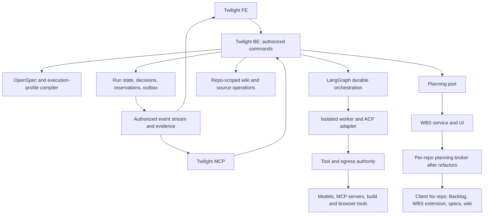

# Twilight control plane

Status: proposed architecture for staged implementation, 2026-09-06. The first
increment is the shared FE/BE/MCP execution loop. [Tasks](tasks.md) distinguishes
that increment from later capabilities. Read the [assumption ledger](../../../docs/twilight-structure/assumptions.md)
and [reference findings](../../../docs/twilight-structure/research.md) before implementation.

## Boundaries



Twilight owns workflow execution and authority. WBS owns its planning semantics.
Backlog.md and its versioned extension own planning persistence after the migration.
OpenSpec owns requirements/artifact contracts. The wiki owns sourced explanations.
These are logical boundaries; the first service does not need a process per box.

Proposed Nx units (created with the behavior that first needs them):

| Unit                      | Responsibility and dependencies                                                           |
| ------------------------- | ----------------------------------------------------------------------------------------- |
| `libs/twilight-contracts` | Validated commands, errors, events, configuration and adapter capability documents        |
| `libs/twilight-domain`    | Pure transitions, authority predicates, finding dispositions, resource accounting         |
| `libs/twilight-runtime`   | LangGraph/checkpointer, durable store, ACP and evidence adapters behind precise ports     |
| `apps/twilight-be`        | Elysia authenticated operations, repository access, streams and orchestration composition |
| `apps/twilight-fe`        | React/Vite run/configuration/decision views, focus presentation, WBS integration          |
| `apps/twilight-mcp`       | Streamable HTTP MCP facade over the same BE operations and caller authority               |
| `apps/twilight-worker`    | Isolated activity host; no access to control-plane credentials or policy writes           |
| `tools/tool-twilight`     | Nx-driven compile, inspect and verify operations sharing the same libraries               |

Do not import WBS app internals to obtain convenient code. Reuse existing shared
auth/validation/observability only after reading its callers/tests and proving
the contract. Existing [MCP forwarding](../../../apps/mcp-01/README.md) is a
pattern, not permission to reuse a process-wide token. Deployment boundaries can
change without duplicating the domain or granting the worker administrator rights.

### Invariant ownership

Three deep modules own the ordering that makes the runtime safe. These are internal
boundaries in `twilight-runtime`, not additional services:

| Module           | Public operation                                                      | Invariants hidden from callers                                                                                                                                                |
| ---------------- | --------------------------------------------------------------------- | ----------------------------------------------------------------------------------------------------------------------------------------------------------------------------- |
| Workflow restore | `restoreRun(runId)`                                                   | Resolve retained executable closure, check checkpoint/store compatibility, load state, reconcile revisions, then permit resume.                                               |
| Authority        | `authorizeAction(request)`                                            | Intersect pinned scope and approval with current identity, grants and safety floors; return a revision-bound decision consumed inside admission/dispatch.                     |
| Effect execution | `admitActivity`, `dispatchEffect`, `reconcileEffect`, `settleAttempt` | Reserve resources, validate authority and attempt fence at dispatch, persist intent/outcome, reconcile uncertainty and release each resource only with its terminal evidence. |

BE routes, graph nodes, workers and hooks call these operations. They cannot load a
checkpoint then independently decide compatibility, assemble policy predicates,
invoke provider transports, or free leases directly. Pure domain predicates remain
internal building blocks. An authorization response is not a reusable bearer grant:
effect execution validates its current revisions at the dispatch boundary. Store,
transport and launcher ports remain private to these modules; tests exercise their
public operations with independent effect/resource observations.

## Single workflow source

The repo's OpenSpec schema is the artifact dependency source. The compiler maps
request/discovery within intent, specification/design, planning, apply activity
and review, verify/integrated/development/handoff, and a separate release command
into the runtime model. The mapping itself is versioned and contract-tested.

The compiled workflow has one key space for policy and hooks: its lifecycle
points, each a stage or activity event (`beforeStage`, `afterStage`,
`beforeActivity`, `afterActivity`, `beforeTool`, `afterTool`, `onFinding`,
`onApproval`, `onFailure`, `onCancel`) qualified by the stage or activity it
belongs to. A versioned `execution.yaml` beside the schema supplies policies
keyed by those lifecycle points, and hook registrations name the same points.
Artifact ids are how the compiler derives stages; they are never policy or hook
keys, and the profile is not a second list of stage dependency edges.

The compiler consumes schema, templates, execution profile, repository manifest,
provider capabilities and referenced skill/prompt versions. It produces a content
digest, resolved lifecycle graph, effective policies with origins, artifact
requirements, capabilities and schema-driven configuration forms. Unknown fields,
missing/unreadable required inputs, cycles or unsupported controls are errors.
Human policy can choose fewer checkpoints but cannot drop mandatory evidence.

This pilot's schema has no automatic compiler/enforcement; it tests the inputs.
The first custom tool is this narrow compiler/verifier. Do not build a generic
workflow language, whole wiki database or provider SDK before the compiler and
first durable loop demonstrate what is actually missing.

## Commands and shared contracts

All writes accept a client-generated idempotency key and expected entity revision.
The server derives actor and authorization scope from verified caller identity.
Opaque string identifiers are validated at the boundary; repository identity is
stable and separate from a filesystem path or remote URL. Illustrative normative
TypeScript contracts for the first increment (runtime schema is their source):

```ts
type CommandScope = {
  repositoryId: string;
  idempotencyKey: string;
};

type SubmitRequest = CommandScope & {
  title: string;
  outcome: string;
  workflowRevision: string;
  plan: PlanRef | null;
  discoveryEnvelopeRevision: string | null;
};

type PlanRef = {
  repositoryId: string;
  planId: string;
  changeId: string;
  planningCommit: string;
  sourceBaseCommit: string;
  requirementsDigest: string;
};

type DecideApproval = CommandScope & {
  approvalId: string;
  expectedRevision: number;
  subjectDigest: string;
  decision: 'approve' | 'reject';
  reason: string;
};

type RunCommand = CommandScope & {
  runId: string;
  expectedRevision: number;
  action: 'pause' | 'resume' | 'cancel';
};

type UsageObservation =
  | {
      status: 'measured';
      inputTokens: number;
      outputTokens: number;
      currency: string | null;
      cost: number | null;
    }
  | { status: 'unavailable'; provider: string; reason: string };
```

`null` plan means discovery has no work plan yet; it cannot pass implementation
admission. Request submission authorizes only its displayed, versioned discovery
envelope: research/artifact write paths, provider/resource limits, deadline and
read-only product-code access. Discovery activities use that envelope instead of
a nonexistent implementation plan. Missing envelope means no automatic model
spend; manual artifact authoring remains available through the same workbench.
For that manual-only mode, `discoveryEnvelopeRevision` is null and automated
discovery admission is refused until a valid envelope is explicitly selected.
`null` cost means token measurements do not establish billed spend.
Invalid trusted persisted records throw; modeled request/permission/conflict
failures return typed responses. Required provider usage absent at a strict budget
boundary refuses admission. An optional display can show unavailable usage.

| BE operation                                    | MCP operation       | FE entry                             |
| ----------------------------------------------- | ------------------- | ------------------------------------ |
| `POST /api/repositories/:id/requests`           | `submit_request`    | Repository → New request             |
| `PUT /api/runs/:id/artifacts/:kind`             | `revise_artifact`   | Workbench editor / artifact proposal |
| `POST /api/runs/:id/plans`                      | `adopt_plan`        | Validate and select a complete plan  |
| `GET /api/runs/:id`                             | `get_run`           | Run detail                           |
| `GET /api/runs/:id/events?after=cursor`         | `list_run_events`   | Timeline / reconnect                 |
| `POST /api/runs/:id/commands`                   | `command_run`       | Pause / resume / cancel              |
| `POST /api/approvals/:id/decisions`             | `decide_approval`   | Approval diff                        |
| `POST /api/repositories/:id/workflows/validate` | `validate_workflow` | Draft preview                        |
| `POST /api/repositories/:id/workflows`          | `publish_workflow`  | Publish configuration                |
| `GET /api/repositories/:id/capacity`            | `get_capacity`      | Queue and pool view                  |
| `GET /api/evidence/:id`                         | `read_evidence`     | Evidence detail                      |
| `POST /api/effects/:id/resolutions`             | `resolve_effect`    | Recovery inbox                       |

MCP `decide_approval` is exposed only for human-decision credentials with verified
interactive provenance; agent/service tokens can request a decision and poll it,
but cannot synthesize human approval. A hosted MCP client's ordinary user token
does not prove each model-selected call is a human decision. Require a short-lived,
single-action decision token issued by the interactive approval UI/flow and bound
to the exact subject. Production additionally requires an explicit release command.

M1 uses the existing `libs/auth` OIDC/JWKS primitives with a separately configured
Twilight client/audience. Its browser login uses authorization code + PKCE,
state/nonce validation and a durable server-side session bound to a hardened
cookie. Bootstrap configures one organization ID, issuer/client and explicit
membership/repo bindings; no arbitrary issuer or self-asserted group grants access.
Do not reuse WBS's identity tables or in-memory session store as Twilight authority.

`POST /api/decision-tokens` requires that browser session, same-origin/CSRF checks
and explicit confirmation of the displayed action/subject digest. It records a
short-lived, single-use token bound to actor, organization, repository, action,
subject, expected revision, expiry and intended consumer; consumption and decision
commit are atomic. The consumed token is bound to the committed command identity
(actor, consumer, repository, idempotency key and canonical parameter digest).
After authenticating the caller and authorizing access to that stored answer,
an exact retry returns the original decision receipt before token consumption or
expected-revision checks; it neither creates a new decision nor re-admits work.
This includes acknowledgment loss and a token that expired after commit. The
receipt describes the historical decision, not fresh authority to execute.
A different command using the consumed token is refused, as are different
parameters under the same idempotency key. Unconsumed expired tokens are refused.
A bearer token alone cannot call the mint endpoint, even if it
represents the same user. The token may be handed to the authorized MCP client for
that exact action. Agents never receive the browser cookie or session's mint
capability. This is a trusted interactive-session boundary, not a claim to infer
human presence from model text; stronger step-up can be required by policy.

Operation parity includes `resolve_effect` and release decisions under that same
human-provenance rule. All workflow operations have FE and MCP access; bootstrap
and interactive token issuance are authority-establishment flows, not permissions
an agent MCP token can grant itself. Twilight MCP uses authenticated Streamable
HTTP, the transport [WBS MCP already serves](../../../apps/mcp-01/src/http.ts).
Task 5.1 reads its OAuth verifier before deciding reuse, but not its per-request
bearer forwarding: the MCP authorization specification forbids passing a token
issued for the MCP server on to another service, and A36 fixes the alternative
(token exchange, else a service credential carrying the verified actor). Shared
transport does not imply shared product identity or permissions.

Artifact edits carry expected artifact/run revisions, content digest, kind,
source basis and author. They live in an isolated repository draft workspace and
content-addressed storage until publication as a source candidate. Discovery agents
propose intent, assumptions, specs/design and tasks using `revise_artifact`; the
same workbench supports manual editing. `adopt_plan` validates all capabilities,
design applicability, task/dependency/resource contracts and source basis before
minting a plan reference and requesting implementation approval. Incomplete drafts
cannot start implementation. No shell editing or pre-discovery implementation
approval is necessary to complete the request-to-plan loop.

Repository workflow files are the authored configuration source. Publication
carries an expected source revision, validates a draft diff, and publishes a
repository candidate commit through a serialized CAS write. The compiled snapshot
is an immutable index of that commit/package closure, not another editable config.
A clean checkout/CLI at that revision compiles the same digest. The activated
digest is an explicit server record; a Git edit alone cannot activate it. Concurrent
stale publication returns conflict. Active runs keep their pinned execution
snapshot; current authority remains independently enforceable as described below.

## Durable execution and effect ownership

The first topology is one active coordinator using a separate durable SQLite
store and a restart-tested LangGraph JS checkpointer. That store's migrations run
through be-01's runner extracted into a shared library, with the same `down.sql`
rule and lint (A38); Twilight does not carry a second migration mechanism.
Select/pin actual compatible packages in Task 1; Bun compatibility is an experiment, not inherited from Node
documentation. Never use an in-memory saver in acceptance. No promise of active
horizontal coordinators until leases and transactional admission pass races.

Persist request/run/stage/activity attempts, decisions, findings/verdicts,
reservations, effect intents, evidence metadata, and outbox records. Persist a
monotonic revision and transition ID. The application transaction commits an
authorized transition plus outbox entry; the graph consumes/reconciles it by that
ID. Graph checkpoints reference the transition revision. A crash between store
and graph writes is recovered through the outbox and revision reconciliation,
not a fictional transaction spanning two independent databases.

### Executable compatibility and upgrades

Each run retains an immutable compatibility manifest alongside its compiled digest:
controller/graph implementation build, compiler/mapping version, Bun and dependency
lock digest, checkpoint format/serializer and saver versions, application store
schema, and each hook/adapter implementation digest plus input/output protocol.
Configuration and prompt pins alone are insufficient. Retain the executable package
closure and a tested compatibility matrix for every resumable run. Never resolve a
hook name to its latest implementation when restoring an older run.

`restoreRun` verifies availability, readability, integrity and supported compatibility
before loading a checkpoint into executable code. An absent package, changed hook,
unknown serializer or incompatible store schema blocks resume with a specific
recovery reason and zero worker/effect dispatches. No silent latest-version fallback.
M1 can refuse an upgrade while incompatible nonterminal runs exist; it does not
promise to host every historical graph. A compatible new controller may host the
pinned closure only after its old-checkpoint/new-controller fixture passes. Any
later supported incompatible upgrade needs an explicit, versioned migration of a
preserved checkpoint copy; revalidate affected authority/evidence and retain the
original recovery material.

Upgrade rehearsal holds admission, settles or fences outstanding attempts and
reconciles the application store, outbox and graph checkpoint at a named transition.
M1 proves incompatible-upgrade refusal and recovery of its retained supported
closure with a pending approval and recorded uncertain effect. Task 14 adds successful
migration/rollback proofs for each supported upgrade path. Rollback uses a retained
compatible executable and tested reverse migration of both stores without discarding
decisions or effects accepted since upgrade. If this
cannot preserve accepted state, refuse rollback and retain the paused recovery
route; restoring an old backup and losing later commands is not recovery. The
protected recovery command operates without the new controller being healthy.

LangGraph uses thread identity per run. Side-effecting work is isolated behind
durable tasks/effect IDs, with checkpointing before irreversible boundaries.
Interrupt resume may replay the interrupted node. Therefore the node's preamble
must not launch a worker or emit an external effect without deduplication and
reconciliation. See [runtime findings](../../../docs/twilight-structure/research/runtime-patterns.md).

State is a tagged union: `queued`, `running`, `awaiting_approval`, `paused`,
`reconciling`, `failed`, `cancelled`, `completed`. Stage conclusions additionally
carry `current`, `stale`, or `inapplicable` with policy reason. Each retry is a new
attempt under the same logical activity. A lease has an owner/fencing token and
deadline; stale workers cannot publish evidence, initiate new effects, write a
replacement workspace or free replacement capacity. Expiry withdraws authority;
it does not prove the process, remote session or resource has stopped.

Every brokered tool and effectful hook passes through `dispatchEffect`. The private
dispatch path revalidates the run/activity/attempt fence, unexpired lease, current
authority and cancellation state for the persisted intent when committing dispatch
admission in one serialized coordinator boundary. Revocation/fence changes
are ordered with that boundary; a request queued before revocation but not yet
dispatch-admitted is refused. An already dispatched effect may need reconciliation
or cancellation; the system cannot unsend it. Unique new logical effect keys do
not bypass attempt fencing. Worker direct egress is denied, including hooks; source
writes occur only in that attempt's isolated workspace. Fence before requesting
stop, and never reuse its writable mount while any old writer can still reach it.

Record effect intent before dispatch, including stable logical effect key,
parameters digest, attempt fence, authority revisions, target and provider
idempotency support. On unknown outcome, reconcile by the provider's receipt/query
contract. If no safe contract
exists, remain reconciling and require a modeled operator resolution. Never claim
general exactly-once external execution. Cancellation is controlled: fence,
stop/drain, collect terminal evidence for each resource, then release proven-free
reservations. `settleAttempt` owns this accounting, including after coordinator
restart. Local PID exit is evidence only for that process: workspace reuse requires
all writers/mounts detached; remote model jobs, browser sessions and builds require
provider-specific terminal status or a verified termination receipt. Unknown remote
state retains its reservation and visible reconciling state. Budget holds settle
against measured usage or remain explicitly unresolved under the budget policy;
process exit does not make spend zero. Report cancellation complete only after its
resource obligations are settled; abandoning an effect's unknown outcome does not
free an unproven remote resource.

`resolve_effect` requires a recovery-operator decision capability, expected effect
and run revisions, evidence references, and `confirm_succeeded`,
`confirm_not_applied`, or `abandon_unknown`. A fresh attempt after
`confirm_not_applied` requires evidence that the effect did not occur and a new
admission decision. Insufficient evidence permits only continued reconciliation
or `abandon_unknown`, which terminates dependent automatic work while retaining
the unknown outcome. It cannot label that outcome successful or failed. Conflicting
resolutions return 409. Ordinary resume cannot bypass this operation. FE and MCP
expose the same recovery decision subject to human provenance where required.

## Policy, hooks, review and capacity

Policy precedence: platform safety floor → organization → repository → workflow
→ activity. More specific policy can narrow capability or consumption; privileged
policy revision is a separate authorized operation. Data/settings from a wiki or
agent tool response cannot alter policy. Missing/invalid policy blocks admission.
Pinned workflow policy preserves execution semantics, not perpetual permission.
At each admission and immediately at effect dispatch, Authority intersects the
pinned requested scope and approval with current actor/membership/repository grants,
approval expiry/revocation, integration credential grants and current platform and
organization safety floors. A current tightening applies to existing runs without
migrating their definition. A relaxation never enlarges an old approval or requested
scope; broader work needs a newly reviewed subject and decision. Return the changed
authority reason while retaining the pinned definition for inspection. An in-flight
effect is reconciled/cancelled according to its action class; no new dispatch may
use an authority revision revoked before dispatch admission.

Approval digest covers the full dependency closure: relevant specs, design,
planning revision, compiled workflow/policy, environment and requested capabilities.
Changing a dependency marks affected verdict/evidence stale, including an ABA
sequence where content returns to an old value: monotonic subject revision prevents
an old in-flight decision from silently becoming current again. Approvals expire
and can be revoked; in-flight cancellation behavior is explicit per action class.

Hooks are registered implementations or sandboxed commands, never arbitrary code
from a browser text field in the first release. Required hooks return typed
allow/deny/error and timeout to deny; optional notifications may visibly degrade.
Critics inspect evidence within read scopes; judges assess attributed findings
against pinned rubrics. Authors do not judge their own deliverable. Keep dissent,
limit revision rounds to two by starting profile, and pause unresolved blockers.

ACP adapters advertise session load/resume, cancellation, permission interception,
MCP transport support, usage signals and tool-event coverage. “Supports ACP” is
not enough. Required controls absent from the adapter must be enforced outside
it or make that workflow inadmissible. Egress/credential policy lives outside the
worker; evaluate Claw Patrol against the actual protocols before adoption.

Admission reserves a vector: agent slots, provider/model rate and token limits,
workspace writer ownership, build/browser slots, and authorized budget. All
reservations happen atomically before launching. Starting counts as occupied.
Use deterministic queue priority plus aging and per-client ceilings; reserve one
reviewer slot when fan-out could consume all worker capacity. Required pools are
acquired together or none are held. Paused human decisions do not occupy workers.

Measured consumption is reconciled against reservations and never overwrites
estimates. Unknown signals carry source/reason; conservative reservations and
process/provider ceilings support hard budgets. Do not promise a precise money cap
when a provider cannot report/limit it. Human effort, elapsed queue time and WBS
workdays remain distinct quantities.

## Planning, knowledge and client portability

Worker credentials are scoped secret references, resolved by the trusted launcher
into an isolated ephemeral credential mount for the selected repository/provider.
No shared operator home or client credential is copied to another workspace.
Cleanup follows observed worker exit; revoke ephemeral grants when supported.
Long-lived integration secrets stay in the secret store until rotation/revocation,
independent of A17's trace retention; credential values never enter evidence.

The [client repository design](../../../docs/twilight-structure/client-repositories.md)
owns the Backlog storage protocol and migration. Initial `PlanningPort` reads the
current canonical task artifact and supplies a revision; it does not create a
second planning database. The later WBS adapter reads/edits Backlog-backed planning
revisions. Completion updates are proposed until the planning owner accepts them;
a worker cannot check its own task without the required evidence.

`PlanningPort.readPlan(reference: PlanRef)` includes plan/change identity, not only
repository and revision. Source candidates pin a change-keyed map of plan references,
generated exports and immutable input receipt snapshots in their plan lock. An
unmerged predecessor cannot unblock an incompatible branch. New completion receipts
are outputs naming the already-created candidate; they are accepted afterward and
never written back into that same candidate. A later candidate can consume them.
Progress receipt revisions are distinct from approved task definitions, preventing
approval churn on each checkbox. The client-repo document owns the multi-change
merge/conflict protocol, publication order and storage acceptance budgets.

Template versions and upgrades are themselves work requests in `puni-00`, with
clean-client fixture generation and deterministic checks. Repo IDs scope retrieval,
integration references, streams and jobs. Client context is selected at the server
boundary before retrieval. Worker mounts, credentials, ports, databases and egress
must be isolated; a Git worktree alone is insufficient isolation.

Knowledge operations use attributable source notes, a contradiction queue and
content manifests. Agent summaries are untrusted claims. Accepted facts link the
requirement/decision/evidence; they do not substitute for it. Compaction preserves
lineage and incoming links, and is evaluated with the same answer set before/after.

## Release and operational limits

Development acceptance checks deployed artifact/commit identity before running a
real cloud-browser scenario. The repo's Playwright server-reuse landmine applies:
own ports and databases, verify the served build identity, then run the complete
browser gate when shared UI/CSS changes. A screenshot alone is insufficient.

Release command binds a verified candidate, environment, migration plan, health
checks and recovery procedure. Credentials stay outside worker control. The
factory's own upgrades preserve a recovery route runnable without the new factory.
Observe rollout and recovery against actual admin/runtime state, not only exit 0.

Full prompt/tool capture is access-controlled and redacted before persistence;
private model reasoning is outside the product contract. Streaming uses durable
sequence cursors and scoped replay; gaps return an explicit resync response.
Retention defaults in A17 are provisional configuration, not legal requirements.

Critical unresolved facts are scheduled experiments, not unanswered questions:
Task 1 fixes package/checkpointer capability; Task 6 proves live ACP containment;
the Backlog phase pins the landed refactor API and proves lossless transactions.
Failure of an experiment revises the design before the dependent milestone starts.
