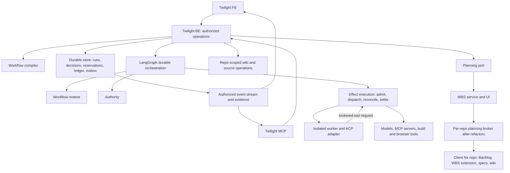

# Twilight control plane

Status: proposed architecture for staged implementation, 2026-09-06. The first
increment (M1 in [tasks](tasks.md)) is the shared FE/BE/MCP execution loop. Read
the [assumption ledger](../../../docs/twilight-structure/assumptions.md) and the
[research index](../../../docs/twilight-structure/README.md) before implementation.
Normative MUSTs live in the [control-plane spec](specs/twilight/control-plane/spec.md);
this document explains the mechanism and is not a second copy of the rules.

## Applicability

Technical design is required: this change defines durable workflow execution,
authority, concurrent planning, integration and scaling contracts across services.

## Boundaries



Twilight owns workflow execution and authority. WBS owns its planning semantics.
Backlog.md and its versioned extension own planning persistence after the migration.
OpenSpec owns requirements and artifact contracts. The wiki owns sourced explanations.
These are logical boundaries; the first service does not need a process per box.
The worker has no path to the outside except a brokered request that passes
through effect execution; egress and credential policy live in the coordinator.

Proposed Nx units, created with the behaviour that first needs them:

| Unit                      | Responsibility and dependencies                                                           |
| ------------------------- | ----------------------------------------------------------------------------------------- |
| `libs/twilight-contracts` | Validated commands, errors, events, configuration and adapter capability documents        |
| `libs/twilight-domain`    | Pure transitions, authority predicates, finding dispositions, resource accounting         |
| `libs/twilight-runtime`   | LangGraph/checkpointer, durable store, ACP and evidence adapters behind precise ports     |
| `apps/twilight-be`        | Elysia authenticated operations, repository access, streams and orchestration composition |
| `apps/twilight-fe`        | React/Vite run/configuration/decision views, focus brief, WBS integration                 |
| `apps/twilight-mcp`       | Streamable HTTP MCP facade over the same BE operations and caller authority               |
| `apps/twilight-worker`    | Isolated activity host; no access to control-plane credentials or policy writes           |
| `tools/tool-twilight`     | Nx-driven compile, inspect and verify operations sharing the same libraries               |

Do not import WBS app internals to obtain convenient code. Reuse existing shared
auth/validation/observability only after reading its callers and tests and proving
the contract. Existing [MCP forwarding](../../../apps/mcp-01/README.md) is a
pattern, not permission to reuse a process-wide token.

### Invariant ownership

Three deep modules own the ordering that makes the runtime safe. They are internal
boundaries in `twilight-runtime`, not services:

| Module           | Public operation                                                      | Invariants hidden from callers                                                                                                                                                |
| ---------------- | --------------------------------------------------------------------- | ----------------------------------------------------------------------------------------------------------------------------------------------------------------------------- |
| Workflow restore | `restoreRun(runId)`                                                   | Resolve retained executable closure, check checkpoint/store compatibility, load state, reconcile revisions, then permit resume.                                               |
| Authority        | `authorizeAction(request)`                                            | Intersect pinned scope and approval with current identity, grants and safety floors; return a revision-bound decision consumed inside admission/dispatch.                     |
| Effect execution | `admitActivity`, `dispatchEffect`, `reconcileEffect`, `settleAttempt` | Reserve resources, validate authority and attempt fence at dispatch, persist intent/outcome, reconcile uncertainty and release each resource only with its terminal evidence. |

BE routes, graph nodes, workers and hooks call these operations. They cannot load a
checkpoint and decide compatibility themselves, assemble policy predicates, invoke
provider transports, or free leases directly. An authorization response is not a
reusable bearer grant: effect execution validates current revisions at the dispatch
boundary. Store, transport and launcher ports stay private to these modules; tests
exercise the public operations with independent effect and resource observations.

## Single workflow source

The repository's OpenSpec schema is the artifact dependency source. The
[execution profile](../../../openspec/schemas/twilight-v1/execution.yaml) beside it
owns the stage dependency graph, maps artifacts onto stages, declares activities,
assigns lifecycle policies, registers hooks and defines delivery profiles. The compiler consumes schema,
templates, execution profile, repository manifest, provider capability documents and
referenced skill/prompt versions, plus an explicit `organizationSnapshot`: organization
identity, floor/pool/rate-card revisions and contents with a content digest. The CLI
requires `--organization-snapshot <path>`; missing, unreadable or corrupt snapshots
fail before publication. The same Git inputs **and snapshot** reproduce the digest;
compilation never silently consults a server's latest organization state.
It produces a content digest, the resolved
lifecycle graph, effective policies with their origins, artifact requirements,
capabilities and schema-driven configuration forms. Unknown fields, missing or
unreadable required inputs, cycles, unsupported controls and a profile below the
repository floor are compile errors.

The mapping is versioned and contract-tested. This pilot's schema has no automatic
enforcement; the first custom tool is the narrow compiler/verifier. Do not build a
generic workflow language, a whole wiki database or a provider SDK before the
compiler and the first durable loop show what is missing.

## Stages, activities and the execution profile

`execution.yaml` owns the stage vocabulary and its `stages[].after` DAG;
[SDLC stages](../../../docs/twilight-structure/sdlc-stages.md) explains each boundary.
The compiler checks stage and artifact graphs independently: artifact mappings are
inputs/evidence, never stage edges. It expands deliverable-scoped stages per stable
deliverable ID. Their edges wait only for that deliverable; integration candidates
join explicit member sets, while handoff joins all required accepted outcomes.
Stage state and hooks carry scope identity, so a slow sibling does not block a
finished deliverable's review or tests. Thus specs and design may share a stage without
a self-cycle, and verification, acceptance and handoff may share `verify.md` without
losing their order. A stage with only skipped/inapplicable activities retains its
boundary and dispositions, not fabricated pass evidence. `release` additionally
requires its human command; readiness alone cannot trigger it.

Each catalog activity names its stage, class and `executor: agent | tool`. A tool
names a registered implementation; an enabled agent resolves a model from its
activity override or class default. The compiler emits a total resolved activity
plan for the selected delivery profile. Adding an activity requires settings in
each profile, not another Markdown artifact. Conditional applicability is evaluated
before admission with its reason recorded; it never removes a floor obligation.
The catalog's `resources` vector is augmented by the registered executor's minimum
requirements and resolved provider/model rate limits. The compiler emits this
complete vector; admission does not infer that every tool consumes agent slots.
The repository gate reserves build/workspace capacity, browser verification reserves
browser/workspace capacity, and a cloud-browser agent additionally reserves an
agent slot. Unknown resource kinds or unsatisfied executor requirements fail.

Lifecycle points are the one key space for policies and hooks. A point is
`<event>.<stage or activity id>`, with `*` matching all. Events: `beforeStage`,
`afterStage`, `beforeActivity`, `afterActivity`, `beforeTool`, `afterTool`,
`onFinding`, `onApproval`, `onRework`, `onFailure`, `onCancel`, `onTrigger` and
`onProfileChange`. Artifact ids are never policy keys. `onTrigger` and
`onProfileChange` take `*` only; a trigger policy selects `triggerKinds` from
`manual`, `schedule`, `webhook`. Other targets must name a declared stage/activity
of the event's kind. `onTrigger.schedule` is invalid: schedule is a trigger kind.

A hook registration names an implementation and version, the points it attaches
to, whether it is mandatory, its timeout and timeout behaviour, its declared
capabilities and its idempotency class. Registered implementations and sandboxed
commands are the only kinds in the first release.

Policy scope, most general first: platform floor, organization floor, repository,
workflow revision, activity, run. Defaults are distinct from authority: a lower
scope may choose higher or lower resource/review settings within current grants,
capabilities, approved hard caps and floors. `repositoryFloor` is the sole local
floor declaration; activity flags do not duplicate it. Override rules are described
under [Profile resolution](#profile-resolution). Per-tool policy uses
`beforeTool.<activity>`. Presentation stays outside the authority chain.

Organization floors, capacity pools and rate cards are privileged server records.
Repository capacity settings request bounded defaults; repository files cannot
publish organization prices or increase pool authority. Publication retains the
explicit organization snapshot beside the Git candidate so a clean CLI checkout can
obtain the identical inputs. Later admissions also check current authority and prices;
their snapshots are retained per attempt without rewriting the compiled definition.

## Commands and shared contracts

All writes accept a client-generated idempotency key and an expected entity revision.
The server derives actor and authorization scope from verified caller identity.
Opaque string identifiers are validated at the boundary; repository identity is
stable and separate from a filesystem path or remote URL. Illustrative contracts
for the first increment (the runtime schema is their source):

```ts
type CommandScope = {
  repositoryId: string;
  idempotencyKey: string;
};

type ProfileSelection = {
  name: string;
  revision: string;
  overrides: DeliveryProfileOverrides;
  reason: string | null;
};

type SubmitRequest = CommandScope & {
  title: string;
  outcome: string;
  workflowRevision: string;
  profile: ProfileSelection;
  plan: PlanRef | null;
  discoveryEnvelope: string | null;
};

type PlanRef = {
  repositoryId: string;
  planId: string;
  changeId: string;
  planningCommit: string;
  sourceBaseCommit: string;
  requirementsDigest: string;
};

type DecideApproval = CommandScope & {
  approvalId: string;
  expectedRevision: number;
  subjectDigest: string;
  decision: 'approve' | 'reject';
  reason: string;
};

type RunCommand = CommandScope & {
  runId: string;
  expectedRevision: number;
  action:
    | { kind: 'pause' | 'resume' | 'cancel' }
    | { kind: 'retry'; activityId: string }
    | { kind: 'skipActivity'; activityId: string; reason: string }
    | { kind: 'changeProfile'; profile: ProfileSelection };
};

type Observation<T> = { status: 'measured'; value: T } | { status: 'unavailable'; reason: string };

type UsageObservation = {
  provider: string;
  inputTokens: Observation<number>;
  outputTokens: Observation<number>;
  cacheReadTokens: Observation<number>;
  cacheWriteTokens: Observation<number>;
  estimatedCost: Observation<Money>;
  billedCost: Observation<Money>;
};
```

A `null` plan means discovery has no work plan yet and cannot pass implementation
admission. `discoveryEnvelope` names an envelope from the profile; `null` selects
manual authoring only, and automated discovery admission is refused until an
envelope is chosen. `estimatedCost` is tokens times the rate-card entry pinned at
admission; unavailable rates or required token categories leave the estimate
unavailable with a reason, never zero. Any hard money cap requires a defensible
priced upper bound before admission. `billedCost` is the provider's reported figure.
The adapter declares whether cache tokens are included in input tokens and
normalizes disjoint charge categories before pricing; it cannot count them twice.
Invalid trusted persisted records throw; modeled request, permission and conflict
failures return typed responses.

| BE operation                                    | MCP operation          | FE entry                             | Owner  |
| ----------------------------------------------- | ---------------------- | ------------------------------------ | ------ |
| `POST /api/repositories/:id/requests`           | `submit_request`       | Repository → New request             | Task 3 |
| `PUT /api/runs/:id/artifacts/:kind`             | `revise_artifact`      | Workbench editor                     | Task 3 |
| `POST /api/runs/:id/plans`                      | `adopt_plan`           | Validate and select a complete plan  | Task 3 |
| `GET /api/runs/:id`                             | `get_run`              | Run detail                           | Task 3 |
| `GET /api/runs/:id/events?after=cursor`         | `list_run_events`      | Timeline / reconnect                 | Task 7 |
| `POST /api/runs/:id/commands`                   | `command_run`          | Pause, resume, cancel, retry, skip   | Task 3 |
| `POST /api/approvals/:id/decisions`             | `decide_approval`      | Approval diff                        | Task 3 |
| `POST /api/decision-tokens`                     | none (browser only)    | Approval confirmation                | Task 3 |
| `POST /api/repositories/:id/workflows/validate` | `validate_workflow`    | Draft preview                        | Task 5 |
| `POST /api/repositories/:id/workflows`          | `publish_workflow`     | Publish configuration                | Task 5 |
| `GET /api/repositories/:id/policy?scope=`       | `get_effective_policy` | Effective value, origin, restriction | Task 5 |
| `PUT /api/organizations/:id/floors`             | `publish_floor`        | Organization floors (privileged)     | Task 5 |
| `GET /api/repositories/:id/capacity`            | `get_capacity`         | Queue and pool view                  | Task 4 |
| `PUT /api/organizations/:id/capacity`           | `set_capacity`         | Pool sizing (privileged)             | Task 4 |
| `PUT /api/organizations/:id/rate-card`          | `publish_rate_card`    | Rate card (privileged)               | Task 4 |
| `GET /api/runs/:id/ledger`                      | `read_ledger`          | Run cost and time                    | Task 4 |
| `GET /api/repositories/:id/outcomes`            | `read_outcomes`        | Profile comparison                   | Task 7 |
| `POST /api/repositories/:id/defects`            | `report_defect`        | Report defect against a candidate    | Task 7 |
| `GET /api/evidence/:id`                         | `read_evidence`        | Evidence detail                      | Task 7 |
| `POST /api/effects/:id/resolutions`             | `resolve_effect`       | Recovery inbox                       | Task 4 |

Privileged operations need the organization administrator capability and are
themselves revisioned and evented. Bootstrap (organization id, issuer, member and
repository bindings) is a trusted operator command, and its resulting bindings are
readable through `get_effective_policy`; bootstrap is not exposed to agents because
it establishes the authority every other operation checks.

### Human decisions

The [spec](specs/twilight/control-plane/spec.md) states what a human decision must
be bound to and how single use behaves. The mechanism:

- M1 uses `libs/auth`'s OIDC/JWKS primitives with a separately configured Twilight
  client and audience. The browser login is authorization code with PKCE, state and
  nonce validation and a durable server-side session on a hardened cookie (A30).
- `POST /api/decision-tokens` requires that session, same-origin/CSRF checks and
  confirmation of the displayed action and subject digest. It records a short-lived,
  single-use token bound to actor, organization, repository, action, subject,
  expected revision, expiry and intended consumer.
- Consuming the token and committing the decision is one transaction, and the token
  is then bound to the committed command identity (actor, consumer, repository,
  idempotency key, canonical parameter digest). An exact retry returns the stored
  receipt; a different command or different parameters is refused (A42).
- The token may be handed to the authorized MCP client for that exact action.
  Agents never receive the browser cookie or the mint capability. Twilight MCP
  verifies its own audience and never forwards that token to BE; it uses issuer
  token exchange or a service credential carrying the verified actor (A36).

### Artifacts and configuration publication

Artifact edits carry expected artifact and run revisions, content digest, kind,
source basis and author. They live in an isolated draft workspace and
content-addressed storage until published as a source candidate. Discovery agents
and people use the same `revise_artifact`; `adopt_plan` validates capabilities,
design applicability, task/dependency/resource contracts and source basis before
minting a plan reference and requesting implementation approval.

Repository workflow files are the authored configuration source. Publication
carries an expected source revision, validates a draft diff, and publishes a
repository candidate commit through a serialized compare-and-swap. The compiled
snapshot is an immutable index of that commit and package closure. A clean
checkout with the retained organization snapshot compiles to the same digest. Activation is an explicit
server record; a Git edit alone activates nothing. Active runs keep their pinned
snapshot; current authority still constrains them (next section).

## Durable execution and effect ownership

The first topology is one active coordinator with a separate durable SQLite store
and a restart-tested LangGraph JS checkpointer. The store's migrations run through
be-01's runner extracted into a shared library, under the same `down.sql` rule and
lint (A38). Task 1 pins actual compatible packages, including the LangGraph floor
that node timeouts and cooperative drain need, and chooses synchronous
checkpointing unless the driver's crash tests justify otherwise. Never use an
in-memory saver in acceptance. Horizontal coordinators wait for leases and
transactional admission to pass races.

Persist request, run, stage and activity attempts, decisions, findings and
verdicts, reservations, effect intents, ledger entries, evidence metadata and
outbox records, each with a monotonic revision and transition id. The application
transaction commits an authorized transition plus its outbox entry; the graph
consumes it by that id, and checkpoints reference the transition revision. A
crash between the two writes is recovered through outbox and revision
reconciliation, not a transaction pretending to span two databases.

### Executable compatibility and upgrades

Each run retains a compatibility manifest beside its compiled digest: controller
and graph build, compiler version, Bun and dependency lock digest, checkpoint
serializer and saver versions, store schema, and each hook and adapter
implementation digest with its protocol. Configuration pins alone are not enough;
the executable package closure is retained for every resumable run.

`restoreRun` verifies availability, readability, integrity and supported
compatibility before loading a checkpoint. An absent package, changed hook,
unknown serializer or incompatible schema blocks resume with a specific reason and
zero dispatches; a hook name is never resolved to its latest implementation for an
old run. The first increment may refuse an upgrade while incompatible nonterminal
runs exist and does not promise to host every historical graph. Upgrade rehearsal
holds admission, settles or fences outstanding attempts and reconciles store,
outbox and checkpoint at a named transition. Rollback uses a retained compatible
executable and a tested reverse migration of both stores; if accepted decisions or
effects cannot be preserved, rollback is refused and the paused recovery route is
kept. The protected recovery command runs without the new controller being healthy.
Successful migration and rollback proofs per supported path are Task 14's contract.

### States, attempts and leases

Run state is a tagged union: `queued`, `running`, `awaiting_approval`, `paused`,
`reconciling`, `failed`, `cancelled`, `completed`. A run is `reconciling` while any
of its effects has outcome `unknown`. This is an aggregate status: unknown effects,
failed gates and exhausted deliverable rework block only their dependency closure.
Independent authorized work may continue. Explicit run pause/cancel, exhausted
run budget or run-wide authority revocation blocks all new dispatch. Admission outcomes are `queued`, `admitted`,
`denied`; effect outcomes are `succeeded`, `failed`, `unknown`; a reservation is
`held`, `draining` or `released`. Stage conclusions carry `current`, `stale` or
`inapplicable` with a policy reason, and a skipped activity records the decision
and reason that skipped it. Each retry is a new attempt under the same activity.

LangGraph uses one thread per run. Side-effecting work sits behind durable effect
ids with a checkpoint before each irreversible boundary; an interrupted node may
replay, so its preamble must not launch a worker or emit an effect without
deduplication ([runtime findings](../../../docs/twilight-structure/research/runtime-patterns.md)).

A lease has an owner, a fencing token and a deadline. Expiry withdraws authority
and proves nothing about whether the process, remote session or resource stopped.
Every brokered tool and effectful hook passes through `dispatchEffect`, which
revalidates fence, lease, current authority and cancellation for the persisted
intent inside one serialized coordinator boundary. That boundary ends at the
authorized transport handoff; awaiting a remote result happens outside it, then
settlement records the response in a fresh transaction. A held remote response
cannot serialize other dispatches. The coordinator load budget is owned by
`execution.yaml.scalingAcceptance.coordinator`; Task 4 proves it through the public
operation on an identified host before any supported scale is advertised. A request queued before a
revocation but not yet admitted is refused; an effect already dispatched is
reconciled or cancelled, never unsent. New effect keys do not bypass attempt
fencing. Source writes happen only in the attempt's isolated workspace, and a
writable mount is never reused while an old writer can reach it.

Effect intent is recorded before dispatch: logical key, parameter digest, attempt
fence, authority revisions, target and the provider's idempotency support. On an
unknown outcome the provider's receipt or query contract reconciles it; without one
the effect stays `unknown` and needs a modeled operator resolution. Cancellation
fences, stops or drains, collects terminal evidence per resource, then releases
proven-free reservations; `settleAttempt` owns that accounting across restarts.
Local process exit is evidence for that process only. Budget holds settle against
measured usage or stay explicitly unresolved; exit does not make spend zero.

`resolve_effect` needs the recovery-operator capability, expected effect and run
revisions, evidence references, and one of `confirm_succeeded`,
`confirm_not_applied` or `abandon_unknown`. A fresh attempt after
`confirm_not_applied` needs evidence that the effect did not occur and a new
admission. `abandon_unknown` ends dependent automatic work and keeps the outcome
unknown. Conflicting resolutions return 409; ordinary resume cannot bypass this.

## Policy, hooks, review and capacity

At each admission and again at effect dispatch, Authority intersects the pinned
requested scope and approval with current actor, membership and repository grants,
approval expiry and revocation, integration grants and the current floors. A
tightening applies to existing runs without migrating their definition; a
relaxation never enlarges an old approval, and broader work needs a new subject
and decision. The run shows the changed authority reason beside the pinned
definition. Data from a wiki or a tool response cannot alter policy, and missing
or invalid policy blocks admission.

The approval subject is the execution envelope defined by the spec. It pins the
requirements/plan dependency closure and the permitted execution choices, not each
scheduler selection. Missing ranges authorize only the pinned choice. Expanding
scope, ceilings or permitted lineage creates a new subject; a monotonic revision
prevents an A→B→A edit from reviving an old decision. Candidate evidence remains
content-bound even when composition is authorized by the envelope.
Approvals expire and can be revoked, with in-flight behaviour explicit per action
class.

Mandatory hooks return typed allow/deny/error and deny on timeout; optional hooks
may report `degraded` visibly. Critics inspect evidence within read scopes and hold
no decision authority; judges assess attributed findings against pinned, versioned
rubrics; a safety critic is a critic with a safety rubric, not a separate authority.
Authors never judge their own deliverable. Dissent is kept. The critic count and
judge enablement come from the resolved activity plan; the revision-round limit is
the delivery profile's `rework.maxRounds`;
exhausting the rounds pauses the run with the finding, consumed budget and next
authorized action visible.

ACP adapters advertise session load and resume, cancellation, permission
interception, MCP transport support, usage signals and tool-event coverage.
A required control the adapter lacks is enforced outside it or makes the
workflow inadmissible, and compile-time validation names the gap.

Admission reserves a vector atomically before launch: agent slots, provider and
model rate and token limits, workspace writer ownership, build and browser slots,
and an attempt allowance from the run budget account. Starting counts as occupied.
The scheduler selects feasible ready tasks subject to client ceilings. Tasks that
reach the aging window outrank unaged work, oldest first. Among unaged tasks it
orders estimated remaining dependency-chain duration, declared priority and stable
ID. Among equally aged tasks stable ID breaks ties. Capacity occupancy cannot be
preempted without proven drain; report resource blocking separately from starvation.
Missing agent-duration estimates produce a visible priority/aging fallback, never
workday conversion. Blocked tasks expose their missing pool while other feasible
tasks proceed. Review-ready work has reserved capacity; idle reserve may be borrowed
only by bounded attempts that drain within the fairness window. Paused human
decisions hold no worker. Measured consumption reconciles against reservations and never
overwrites estimates; unknown signals carry source and reason. Human effort,
elapsed queue time and WBS workdays stay distinct quantities (A12).

## Levers, ledger and outcomes

The [execution profile](../../../openspec/schemas/twilight-v1/execution.yaml)
defines available fields and starting values; the
[spec](specs/twilight/control-plane/spec.md) owns their behavioral guarantees.
The following mechanisms connect settings to accounting and comparison.

### Profile resolution

`ProfileSelection.overrides` merges maps by key, replaces scalar values and arrays,
and inherits unspecified fields. Unknown fields fail validation. Per-activity
model assignments replace the class default; models/effort are capability-checked
choices, not an ordered cost or quality scale. Escalation is the selected bounded
ladder, never an implicit provider fallback. Profiles can increase or decrease
model capability, critic count, optional verification and fan-out within the same
authority boundary; a profile's defaults do not become limits.

The total `activities` map alone controls enablement and depth. `review.critic.count`
is positive when enabled and zero when disabled; tool activities cannot carry model
settings. `verification.gate` invokes the repository's full integrated gate;
optional browser work uses `verification.browser.scope`. Cloud acceptance is
explicitly disabled in M1 and enabled only when Task 13 proves its adapter. There
is no second top-level `skip`, `review` or `browserGate` setting to reconcile.
Invalid combinations and disabling a floor activity are rejected, not normalized.

Each accepted profile change creates a profile epoch containing the resolved
settings, digest and effective transition. It affects only work not yet admitted,
after authority validation against the execution envelope. In-envelope selections
need no new human decision; proposed choices outside it wait for approval. Running/draining attempts keep
their epoch and reservations. A lower fan-out queues new work until occupied slots
drain. Budget consumption, unresolved holds, consumed rework rounds and the original
run start survive every epoch; exhausted rounds pause the affected dependency closure.
`skipActivity` produces the same audited enablement override and can affect only an
unadmitted activity. It cannot remove existing findings, completions or evidence.

Approval validity is checked against the **attempt's envelope, epoch and action**.
An envelope can authorize several immutable epochs; each records the chosen values
and why they remain within bounds. An out-of-envelope proposal authorizes no new
admission until approved. Already-admitted work keeps its unchanged allowance and
authority while that proposal waits. Revocation, expiry, changed scope or tighter
floors still constrain all epochs; choosing another epoch cannot expand authority.

### Budget accounts and clocks

Each run has one budget account. Discovery is a suballocation of that account;
its envelope's `allowance` is an additional limit, with the same money scope and
an expiry relative to original run creation, never independent spending authority.
Children, retries, escalation, rework and cancellation/drain all charge it. Creating
a replacement run needs distinct explicit spending authority; retries cannot obtain
fresh budgets by changing run identity. Admission atomically holds a conservative
**attempt allowance**, not the full delivery-profile budget, in every required unit:

`available = hard cap − settled consumption − outstanding holds`

Unknown consumption retains its hold. A cap change from $12 to $40 with $10 settled
and $1 held leaves $29 available; setting a cap below $11 is refused. No rate, model
or profile change clears the account. Holds include bounded cancellation/drain
costs; without a defensible reservation and stopping mechanism, hard-budget
admission fails. Reaching a hard cap stops new dispatch and pauses unresolved work.

`budget.scope` is `run`. Under `enforcement: strict`, `limits` are hard caps. Under
`advisory`, they are warning targets and an explicit same-unit `hardLimits` vector
at least as large is required; advisory never grants unbounded spend. Crossing a
target records an overrun and continues only within the authorized hard vector.
All supplied dimensions constrain admission. Changing hard ceilings or accounting
scope changes the envelope; choosing a permitted model or bounded attempt allowance
does not. Lowering a ceiling below settled usage plus holds is always refused. For example, an $8 advisory money target
inside a $12 hard cap warns after $8 and stops new spend at $12.
`budget.moneyScope` explicitly selects `model` spend (the shipped defaults) or
`delivery`, which includes tool/service/human charges and requires defensible
bounds for all of them. Changing the scope changes the approval subject and
rechecks all prior charges and holds in the new scope; missing history refuses it.

| Quantity                  | Clock and aggregation                                                                                                                                                                                         |
| ------------------------- | ------------------------------------------------------------------------------------------------------------------------------------------------------------------------------------------------------------- |
| `budget.limits.agentTime` | Add occupied agent-session intervals across attempts, including provider/tool wait while occupied; exclude pre-launch queues and human-only pauses without a worker. Tool-only activity duration is separate. |
| Run wall elapsed          | Original `createdAt` to terminal time or the query's `asOf`; includes queueing, approval waits, pauses, drain and recovery.                                                                                   |
| `deadline`                | Duration from original `createdAt`; changing it never resets the start. Expiry pauses new dispatch and drains existing work within its holds. A duration already elapsed is refused on profile change.        |
| Queue wait / human wait   | Per-attempt intervals; run totals union intervals within each kind. They can overlap execution or each other and are never summed into wall elapsed.                                                          |
| Human minutes             | Explicit measured effort, never inferred from approval waiting.                                                                                                                                               |

Four concurrent 30-minute agent sessions consume 120 agent-minutes and about 30
wall-minutes. Each quantity carries timestamps, units and unavailable reasons;
resuming a run does not restart any cumulative clock.

### Pricing and the ledger

The organization snapshot used at compilation supplies prices for enabled agent
choices and permitted escalation. Disabled choices are revalidated when enabled.
Admission pins the current rate-card entry and snapshot on the attempt, with
effective date and disjoint input/output/cache-read/cache-write prices. A price
change re-evaluates the next attempt's reservation; admitted attempts keep their
original estimate and actual billed reconciliation. No historical repricing occurs.

Per-attempt ledger observations preserve planned, held and measured quantities,
serving model, escalation step, rate-card revision and profile epoch. Missing token
telemetry does not erase a separately reported billed amount. Token-priced money
is labeled **model spend**; known tool/service charges and human costs are separate
categories, with coverage shown when total delivery cost is incomplete. Monetary
reservation bounds include every charge category inside the authorized budget's
scope; an unknown charge is not free. Aggregates retain units and coverage through
run, request and repository roll-ups, including failed/cancelled attempts and runs.

A charge record is keyed by run, attempt, logical effect and charge category, with
currency, a conservative maximum, quoted/rate revision, observed amount or unavailable
reason, and source receipt. Organization snapshots supply non-model rates as
`{category, service, unit, price, effectiveFrom}`; supported units are per request,
service minute and human minute. An alternative binding quote supplies a maximum
amount with expiry. Adapters advertise whether the bound and stopping mechanism
cover all effects they can cause. Settlement uses provider receipts or approved human
effort and retains the hold if either is missing. Shared invoices need explicit
charge allocations whose sum matches the invoice; unallocated charges keep history
incomplete. Model-to-delivery scope changes resolve the complete charge inventory
before reapproval; unsupported services or missing history refuse the change.

### Comparable outcomes

Every terminal run gets an outcome record; later defect reports append revisions.
The record retains all ordered profile epochs and identifies single-profile or
mixed-profile work. Attempt cost follows its epoch; a economy implementation recovered
under thorough is a mixed outcome, not a win or loss attributed wholly to either.
Request cost includes unsuccessful runs. Cost per accepted outcome includes their
cost in the numerator; no accepted outcome gives an unavailable ratio, not zero.

`execution.yaml.quality` is the canonical authored evaluation definition. Its initial
`delivery-baseline` binds the independent `acceptance.evaluate` task-acceptance tool
and the integrated gate. Task 8 supplies two clean instances of one versioned task
fixture and its independently authored assertions; an unavailable task oracle is
recorded as unavailable. The evaluator's tool activity consumes its catalog resources
and charges the same budget account. It is a candidate acceptance floor; an absent
oracle blocks acceptance visibly. Handoff cannot supply evidence that acceptance
was already required to possess.

The existing workflow preview/publication operations carry evaluation edits.
Changing `quality` requires the organization's evaluation-publisher capability and
a subject-bound human decision. The compiler hashes the complete definition, rubric
and observation set into separate immutable revisions. `submit_request` pins these
from the selected compiled workflow; cohort identity also pins the task fixture's
digest. Neither a worker nor a delivery-profile override selects a different judge.

An independent evaluation revision pins the rubric, required observation set,
task/cohort identity, accepted-outcome definition and defect window. `quality` in
the execution profile owns this shared definition, not delivery-profile overrides.
Publishing a changed evaluator preserves prior observations and creates a separate
comparison cohort. M1 runs the same fixed evaluator on both delivery profiles;
larger optimization and promotion remain later work.

Each expected observation is passed, failed, skipped or unavailable. Defect records
show accepted time, observation coverage, `observedThrough`, and whether the window
is still open, mature or incomplete. No reports in an immature/unobserved window
are not evidence of zero defects. `read_outcomes` shows all records but ranks only
matched tasks/cohorts with compatible definitions and exposure; mixed-profile and
incomparable observations remain visible outside single-profile comparisons.
Sample counts and denominators accompany comparisons. Two runs prove the plumbing,
not enough evidence to replace profile defaults automatically.

`report_defect` accepts an authorized candidate reference, source evidence,
`reportedAt`, expected outcome revision and idempotency key through FE/BE/MCP.
The server validates repository/candidate lineage and records the report once;
linking it to an outcome asserts no causal blame for a particular model. Estimates
remain alongside actuals; profile-default changes are ordinary evaluated work requests.

## Scheduling, integration and scaling

The optimization objective is accepted elapsed time at fixed quality. Delivery
profiles choose defaults; the execution envelope bounds permissible adaptation.
An operator may use a balanced or thorough quality profile with more execution
capacity. The economy profile trades activities and model choices for lower spend
and is not a speedup benchmark. A deadline is a stop condition, not a speed policy.

`WorkPlan` deliverables carry interface/acceptance contracts, real predecessors,
write scope, source basis and duration observations. The scheduler derives readiness
from those contracts and accepted or explicitly composed predecessor evidence. It
never turns a shared owner or scarce browser into a semantic dependency. Shared
contracts are versioned before consumers split; changed contracts invalidate only
the recorded dependency closure. Read-only evidence/research can be shared by
content identity inside repository authority; writable workspaces remain isolated.

`selectReady` returns selected IDs and scored/blocked reasons; `requestCapacity`
requests workers or supporting build/browser capacity from a registered provisioner
within existing organization grants and the envelope. It cannot call privileged
`set_capacity` to enlarge its own grant. Provider quota, provisioning failure and
budget limits are visible constraints. Additional hosts retain their own gate locks;
provisioning never bypasses h2puni's canonical release lock to fake extra build slots.
Tool waits release only resources proven
free; no optimization weakens fencing or terminal-evidence accounting.

The integration queue owns immutable member sets, base commit, composed source
identity, verification receipts and publication state. `composeCandidate` merges
compatible outputs and plan locks in an isolated workspace; full Nx and applicable
browser gates run on that exact composition through the gate adapters. The queue
can prepare and verify several prospective candidates concurrently. Integration
prepares candidates without publishing source. Acceptance runs its independent
oracle and applicable cloud checks; only then does its durable completion path
invoke `publishCandidate` through effect execution. Handoff requires the accepted
publication receipt. Publication compares the accepted source ref; a moved base
regenerates the candidate and its evidence, including candidate acceptance checks. Failed or conflicting members enter bounded owner repair while independent
candidates continue. Dependent work can use an explicitly composed, tested basis;
it cannot treat a branch label as an integrated predecessor. Production promotion
remains the separate human command.

Candidate acceptance joins every required member's reviews, full composed gate,
applicable browser evidence and independently pinned task oracle. Knowledge handoff
joins all requested outcomes. Any knowledge/source edit creates a new candidate
requiring affected and integrated verification before handoff; generated evidence
is stored outside candidate source so observing completion creates no hash cycle.
Evidence reuse requires matching declared source inputs, toolchain, environment,
policy and oracle identity; shared CSS still receives the whole browser gate.

Opt-in speculation races a bounded number of isolated candidates for one critical
or uncertain deliverable. All branches share the run account and pinned evaluator.
The first passing independent evaluation can select a candidate; first response
alone cannot. Losers are fenced and drained with all cost retained. Only selected
candidates enter the integration queue. Shared publication and production effects
are unavailable to speculative workers.

Task 8 owns the scaling matrix in `execution.yaml.scalingAcceptance`. It measures
fixed requested outcomes, not generated task counts. Supporting pools scale with
workers in the unconstrained controls; separate fixed-pool controls expose queue
saturation. Each workload has identical quality and model settings across capacities.
Record raw samples, cold/warm conditions, provider limits, host identity, estimates
and realized dependency chains. Numerical thresholds are proposed acceptance budgets,
not performance claims. A failed threshold blocks the scaling milestone and identifies
the next constrained resource. No automatic change to quality or evaluation can
manufacture a speedup. M1 remains independent of the Backlog migration.

## Planning, knowledge and client portability

Worker credentials are scoped secret references resolved by the trusted launcher
into an isolated ephemeral mount for the selected repository and provider (A34).
No operator home or client credential is copied to another workspace; the mount is
destroyed after observed exit and short-lived grants are revoked where supported.
Long-lived integration secrets stay in the secret store independent of trace
retention, and credential values never enter evidence.

The [client repository design](../../../docs/twilight-structure/client-repositories.md)
owns the Backlog storage protocol and migration. The initial `PlanningPort` reads
the canonical task artifact with a revision; the later WBS adapter reads and edits
Backlog-backed planning revisions. `PlanningPort.readPlan(reference: PlanRef)`
includes plan and change identity, not only repository and revision. Completion
updates are proposed until the planning owner accepts them; a worker cannot check
its own task without the required evidence.

WBS planning capacity and Twilight admission are different quantities. The
reconciliation contract is: a `WorkPlan` carries resource units per task in A12's
vocabulary (human minutes, agent time, tokens, money, slots) beside WBS workdays;
Twilight reserves against its pools from those units and writes measured usage back
as a progress receipt; no unit is converted into another implicitly. Task 2 owns
the port shape and Task 9 the round trip through Backlog.

Source candidates pin a change-keyed map of plan references, generated exports and
immutable input receipt snapshots in their plan lock. An unmerged predecessor
cannot unblock an incompatible branch. New completion receipts are outputs naming
the already-created candidate, accepted afterwards and never written back into it.
Progress receipt revisions are distinct from approved task definitions, so a
checkbox does not churn approvals. The client-repo document owns the multi-change
merge protocol, publication order and storage acceptance profile.

Template versions and upgrades are work requests in `puni-00`, with clean-client
fixture generation and deterministic checks. Repository ids scope retrieval,
integration references, streams and jobs; client context is selected at the server
boundary before retrieval. Worker mounts, credentials, ports, databases and egress
are isolated; a Git worktree alone is not isolation.

Knowledge operations use attributable source notes, a contradiction queue and
content manifests. Agent summaries are untrusted claims. Accepted facts link the
requirement, decision or evidence they rest on and do not replace it. Compaction
preserves lineage and incoming links and is evaluated with the same question set
before and after, at the targets in the profile's `knowledge` section.

## Release and operational limits

Development acceptance checks deployed artifact and commit identity before a real
cloud-browser scenario runs. The repository's Playwright server-reuse landmine
applies: own ports and databases, verify the served build identity, run the whole
browser gate when shared UI or CSS changes. A screenshot alone is insufficient.

The release command binds a verified candidate, environment, migration plan,
health checks and recovery procedure. Credentials stay outside worker control. The
factory's own upgrades preserve a recovery route runnable without the new factory.
Rollout and recovery are observed against actual admin and runtime state, not exit
codes.

Contract for the M4 delta, not part of M1: after a supported upgraded controller
has accepted a decision and recorded an uncertain effect, the protected recovery
path works without the upgraded controller, preserves both records across the
application store, checkpoint store and outbox, and resumes only a tested
compatible closure without re-dispatching that effect; an unsupported reverse
migration refuses rollback without losing accepted state.

Full prompt and tool capture is access-controlled and redacted before persistence;
private model reasoning is outside the product contract. Streaming uses durable
sequence cursors and scoped replay; a gap returns an explicit resync response.
Retention defaults are the profile's `retention` section until an organization
policy is published.

Critical unresolved facts are scheduled experiments: Task 1 fixes the package and
checkpointer capability; Task 6 proves live ACP containment; Task 9 pins the landed
refactor API and proves lossless planning transactions. Failure of an experiment
revises the design before the dependent milestone starts.
